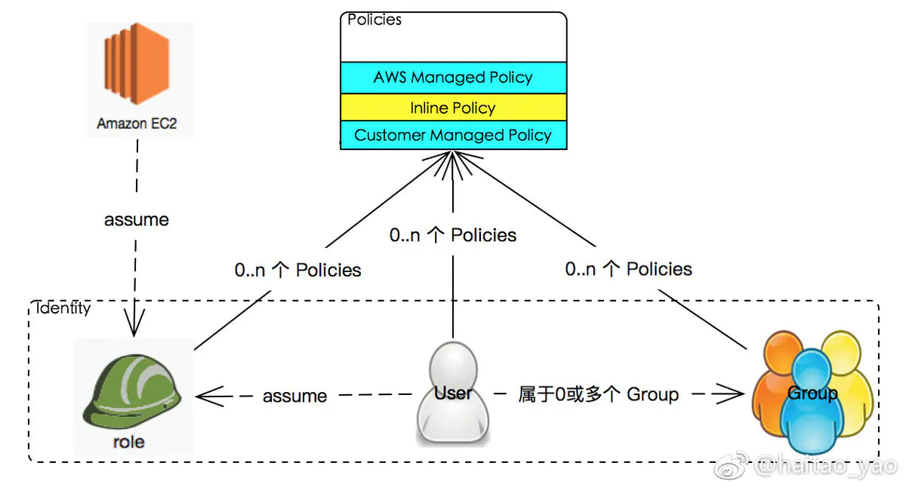

# AWS IAM, 从入门到依旧在入门

2017.05.10 19:56:00字数 1,818阅读 4,894

IAM 全称是 Identity and Access Management, 是 AWS 提供的一个服务, 用来控制对 AWS 资源的访问权限. 

一句话概括就是:

> IAM 核心就是把资源(Resource)上的操作(Action) 授权给谁(Identity)

既然是控制权限, 说白了就是对某个资源(后文统称 Resource) 的某些操作(后文统称 Action) 的控制.

那么学习 IAM, 首先搞清楚三个基本的问题:

1. 如何优雅的定义 Resource? 如果有一个统一的规则, 来为 Resource 命名就再好不过了
2. 如何优雅的定义 Action?
3. Identity

## 00 如何优雅的定义 Resource

AWS 给出的答案是: ARN ([AWS Resource Namespace](https://link.jianshu.com/?t=https://docs.aws.amazon.com/general/latest/gr/aws-arns-and-namespaces.html)). ARN 是一个命名规则, 用于`无歧义`的对 AWS 的资源进行命名.

ARN 的格式如下:

```objectivec
arn:partition:service:region:account-id:resource
arn:partition:service:region:account-id:resourcetype/resource
arn:partition:service:region:account-id:resourcetype:resource
```

- partition 是分区. 通常情况下, 是 `aws`, 但由于不可抗拒的因素, 中国区的 arn 都是使用 `aws-cn`, 例如: `arn:aws-cn:s3:::your-bucket-name`
- service 就是 AWS 各个服务的名称, 具体列表参见 [AWS Service Namespaces](https://link.jianshu.com/?t=https://docs.aws.amazon.com/general/latest/gr/aws-arns-and-namespaces.html#genref-aws-service-namespaces). 需要注意的是, 不是所有的服务都使用了首字母简写. 例如, Elastic Compute Cloud 使用 `ec2`, 但 Elastic Load Balancing 却使用 `elasticloadbalancing`
- region 是 AWS 的区. 中国北京区就是 `cn-north-1`
- account 是自己的 AWS 账户的数字 ID
- resource, resourcetype:resource, or resourcetype/resource 就是具体资源. 参见官方文档 [Paths in ARNs](https://link.jianshu.com/?t=https://docs.aws.amazon.com/general/latest/gr/aws-arns-and-namespaces.html#arns-paths)

## 01 如何优雅的定义 Action

Action 也就是针对 AWS 上的服务提供的 API. 完整列表参见 [AWS Service Actions and Condition Context Keys for Use in IAM Policies](https://link.jianshu.com/?t=http://docs.aws.amazon.com/IAM/latest/UserGuide/reference_policies_actionsconditions.html). 迄今为止, AWS 不知不觉已经提供了几十个服务, 几百个(或者更多) API. Cloudonaut 公司做了一个 [Complete AWS IAM Reference](https://link.jianshu.com/?t=https://iam.cloudonaut.io/), 方便查询 Action, 推荐使用.

至于 Condition Context Keys, 是 AWS IAM 中支持的一个功能, 即在定义 Policy 时可以使用一些变量, 支持复杂的表达式. 比如 `${aws:username}`. 感叹一句: IAM 的配置就是让你用 JSON 语法写代码.

> Every Configuration File is a Programming Language

## 02 Identity

Identity 就是最终把权限赋予给到的实体. IAM 中有三种 Identity, 分别是 User/Group/Role

- User 就是 AWS 的用户, 可以用来登录 AWS Console, 也可以有访问秘钥调用 AWS API 等.
- Group 就是用户组, 用于管理一组用户的权限.
- Role 是角色, 需要被委托给 User 或者 AWS 服务, 使得被委托的实体有对应的权限



Identity 关系

熟悉了 IAM 的三个最基本元素, 还剩下最后一个: Policy

## 03 Policy

Policy 就是权限声明文档. 具体包含几个部分:

- `"Version": "2012-10-17"`: 版本号, 这个 `2012-10-17` 不能随便更改

- ```json
  Statement:
  ```

  : 具体策略的内容, 可以是一个或者多个

  - `Effect`: `Allow` 或者 `Deny`
  - `Action`: 具体操作, 参见 [AWS Service Actions and Condition Context Keys for Use in IAM Policies](https://link.jianshu.com/?t=http://docs.aws.amazon.com/IAM/latest/UserGuide/reference_policies_actionsconditions.html), 可以使用 `*`, 例如 `ec2:*`
  - `Resource`: 具体的资源

更多关于 Policy 如何写, 可以参见官方文档 [Overview of IAM Policies](https://link.jianshu.com/?t=http://docs.aws.amazon.com/IAM/latest/UserGuide/access_policies.html)

从类型上分, Policy 分为三种:

- AWS managed policy: AWS 官方定义的模板 Policy, 按需直接使用即可
- Customer managed policy: 客户自己定义的 Policy 模板, 可以将定义好的 Policy 挂到各种 Identity 上, 例如挂到一个 Group 上.
- inline policy: 仅仅在当前 Identity 下可以用的 policy, 不能复用.

既然一个 User 可以属于多个 Group, 那么一个 User 会有多个 Policy 对其进行约束, 那么难免一个 Identity 所有的多个 Policy 会发生冲突. IAM 采用的策略可以概括为8个字: `凡事声明, 一票否决`。

- `凡事声明`: 默认情况下, Resource 是禁止访问的; 只有显式声明了对资源的 `Allow` 权限, 才允许访问。
- `一票否决`: 即便是有 Policy 开启了 `Allow`, 一旦其他 Policy 中出现对 Resource 的 `Deny` 声明, 一律 `Deny`。

详细文档参见官方文档 [IAM Policy Evaluation Logic](https://link.jianshu.com/?t=http://docs.aws.amazon.com/IAM/latest/UserGuide/reference_policies_evaluation-logic.html)

## 04 IAM Policy Programming 小助手: Simulator

既然 Policy 的书写那么麻烦, 写完的 Policy 是否靠谱就成了问题. AWS 官方通了一个 Simulator, 通过两种方式进行使用:

- 在 AWS console 中使用 Simulator 直接检验自己的 Policy
- 调用 AWS IAM 的 `simulate-custom-policy` API, 直接通过 API. 也可以直接使用 AWS cli

Simulator 仅仅验证提交的 Policy, 不会执行任何真正的操作, 可以放心使用。

关于 simulator 的使用, 具体参见[官方文档 Testing IAM Policies with the IAM Policy Simulator](https://link.jianshu.com/?t=http://docs.aws.amazon.com/IAM/latest/UserGuide/access_policies_testing-policies.html)


## 05 Best Practice (As Far As I Know)

说了这么多, 总结一些最佳实践

0、 通读 AWS 官方文档 [AWS IAM Best Practice](https://link.jianshu.com/?t=http://docs.aws.amazon.com/IAM/latest/UserGuide/best-practices.html)

1、强制贯彻最小权限原则 ([Principle of Least Privilege](https://link.jianshu.com/?t=https://en.wikipedia.org/wiki/Principle_of_least_privilege))

AWS 官方文档也有提到, 这里做一点补充. 有几个小的建议

- 在 Policy 文件中的

  ```
  Action
  ```

  定义, 尽量少使用

  ```
  *
  ```

  ,明确所有 Action

  - 比如 s3 中, `s3:Delete*` 不仅包含 `DeleteObject`, 还包含 `DeleteBucket`, 你想象一下

- 如何确定某个 Role 需要哪些权限是给多了, 强烈建议开启 AWS CloudTrail 服务, 写一个脚本, 通过遍历 CloudTrail 数据确定

2、 能用 IAM Role 解决的问题, 不用明文 AWS Key

固定的 Key 有泄露风险. 但容器时代很多公司使用 k8s + docker, 无法使用 IAM Role, 推荐使用 Terraform 出品的 [Vault](https://link.jianshu.com/?t=https://www.vaultproject.io/) 来管理 AWS Key, Vault 支持 Key Rolling 功能, 类似 AWS STS 的动态 Key, 提升安全性.

3、 尽量简化 IAM Policy 配置

虽然 IAM Policy 功能非常强大, 支持通配符 `*` 也支持表达式, 例如 `StringEqualsIgnoreCase`. 但不要忘记的是: 代码是给人读的, IAM Policy 也一样.

4、 尽量使用 git 等版本管理工具管理 IAM Policy

AWS 官方仅仅提供 Policy 的版本管理, 而且最多保存 5 个版本, 并且没有注释. 建议[使用 Terraform 管理 AWS IAM](https://link.jianshu.com/?t=https://www.terraform.io/docs/providers/aws/r/iam_policy.html).

## 06 借(copy)鉴(cat)

AWS IAM 设计的逻辑非常清晰, 借鉴意义很大. 设想, 如果你要在公司设计一套权限管理系统, 是不是可以借(copy)鉴(cat) IAM?

步骤都给你写好了, 拿走不谢:

1. 定义 Resource 编码原则: 例如 `lrn:department:team:resource_type/resource`
2. 定义每个 Resource 上的 Action. 微服务时代, 如果是使用 gRPC 就更好了, 直接将统一的 protocolbuffer 的定义解析一下, 就可以知道有哪些 service 的哪些 method 了
3. 定义 Identity. 建议直接参考 AWS 的设计: User/Group/Role
4. 定义 Policy 语法. 这里可以微创新一下, 不用 JSON, 哪怕选择一个支持注释语法的文件格式(比如 yaml)
5. 实现 Policy Evaluator. 解析 Policy 给出裁决结果
6. 接入各个系统, 收工.

## 07 总结

AWS IAM 还有很多新奇的玩法, 大家自己去探索吧. 最后推荐一篇写的非常好的 AWS IAM 文章: [AWS IAM Policies in a Nutshell](https://link.jianshu.com/?t=http://start.jcolemorrison.com/aws-iam-policies-in-a-nutshell/)

## Reference

- [AWS Service Actions and Condition Context Keys for Use in IAM Policies](https://link.jianshu.com/?t=http://docs.aws.amazon.com/IAM/latest/UserGuide/reference_policies_actionsconditions.html)
- [AWS IAM 评估逻辑](https://link.jianshu.com/?t=http://docs.aws.amazon.com/zh_cn/IAM/latest/UserGuide/reference_policies_evaluation-logic.html)
- [AWS IAM Best Practice](https://link.jianshu.com/?t=http://docs.aws.amazon.com/IAM/latest/UserGuide/best-practices.html)
- [AWS IAM Policies in a Nutshell](https://link.jianshu.com/?t=http://start.jcolemorrison.com/aws-iam-policies-in-a-nutshell/)


参考：https://www.jianshu.com/p/f59745ae7fad?utm_campaign=maleskine&utm_content=note&utm_medium=seo_notes&utm_source=recommendation