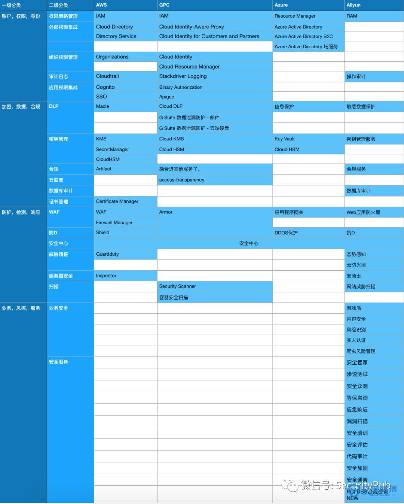
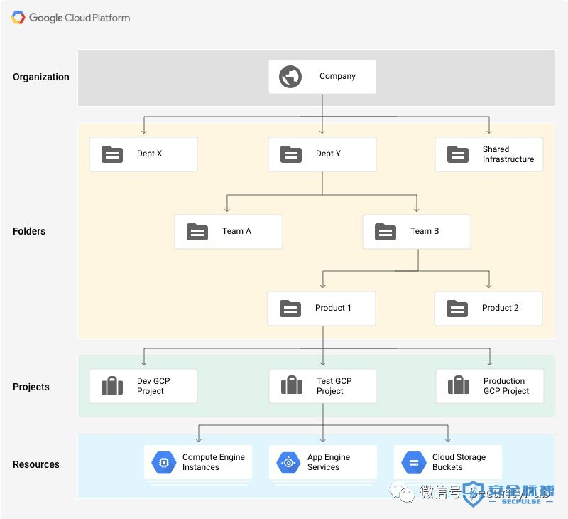

# AWS安全笔记|扯淡与权限

[脉搏文库](https://www.secpulse.com/archives/category/category/secdocs) [SecurityPub](https://www.secpulse.com/newpage/author?author_id=9144)

 2019-04-30 4,872

## 前言

### 1.1 碎碎念

要论述云这么庞大的产品中的安全体系，首先要谈论的也许是这个产品，或者这个公司，团队的原则，或者说他们的产品假设，或者说他们的公司理念。

这个系列文章分为四个。

1. 《扯淡与权限》 
2. 《数据与加密》
3. 《检测与响应》
4. 《服务与体系》

### 1.2 云平台安全产品

额，这表格就这样吧，我有点图省事，事实上这表格在某些方面很难反应真实的情况，比如Azure，和aliyun的方面，我其实关注不多，另一个层面来说，很多细致的功能或者细节其实被合并到了其他组件。可以说完全无法反应各家云平台真实的安全实力。

但其中还是可以看到一些较为明显的差异，比如阿里云的业务安全和安全服务，特别国情。比如在账户权限部分，特别是Azure和AWS，GPC都凸显了在融合企业和应用本身的账户权限体系的努力。

但从安全产品体系的角度来说，其中有不少划分肯定是不正确的，比如google在容器安全方面的努力，被我四舍五入划分到了别的分类。

### 1.3 关于原则

很难说一个企业中的各类文化和原则能够在产品中有多大的体现，不过这里还是提几句我的一些猜想。

**1.3.1 Serverless**

AWS的Serverless理念“用服务代替服务器”很有名，这几年也在大力宣传其代表作Lambda，其余的比如Facebook的Parse。在我不成熟的眼光看来这很像函数式编程，把所有的AWS服务看作一个函数，用Lambda作为转接器凑一凑一个新产品就出来了。

在这种背景下的AWS安全产品看起来有点最小化的意思，比如他们自己近期写的一个博客谈论了Guardduty的告警没有可视化怎么办，简单，通过Cloudwatch event还有lamdba之类的东西把日志提出来，再拿QuickSight读取一下日志自己建个面板就好了特别智能，感觉跟乐高一样。 

**1.3.2 多路径**

Amazon自身有一种团队文化，就是多路径失措，比如一个WAF，你可以假设多种它的发展未来，比如一种是规则系统的极致，或者机器学习的智能化，或者从web攻击抽离出来向业务层的风控发展，或者做前后端用户行为的感知层扩展。那AWS就有不同的团队尝试这不同的方向，最后胜利的得到别的团队的资源。

比如KMS和SecretMange，这是两个团队做出来的产品，但在我看来本质是为了解决一个问题。当然，这也是马后炮。

**1.3.3 最佳实践**

AWS有着安全最佳实践的概念，在AWS的安全产品中，服务器，账户，s3等的安全实践也代表了一种基线，即违反安全最佳实践的操作即代表了一种不安全的状态。类似Adviser还有产品自身控制台，Guardduty，最新的安全中心当检测到违反安全最佳实践的操作或者设置都会进行报警。

## 关于权限

### 2.1 前言

云平台的权限设计所要面临核心问题是多方的，**用户与平台之间，用户与应用之间，平台与应用之间，应用与应用之间，用户与用户之间，账户与账户之间等**等。核心在于三类实体之间的授权，作为人所对应的账户，用户，子用户。以及作为各种类型的服务，以及服务之下的个类型资源。

云平台所能给开发者提供的巨大的赋能机制之一就是平台服务之间的打通。这就对安全提出了各种形式的挑战，如一个账户内的应用与应用之间的授权，以及不同账户应用与应用内的授权。

在完成了基础的平台权限模型之后，更进一步的问题在于，如何在细粒度的策略中平衡组织的灵活性以及权限的安全性，以及如何将云平台的权限机制更进一步于企业本身的组织进行融合。

**2.2 权限管理模型**

常见的AWS账户权限的管理方式有几种类型，实际上以下几种并不冲突可以很好的互相融合一起使用。

**2.2.1 多账户模型**

**通过Organizations关联到多个账户**，比如一个企业有多个部门，那么每个部门分配一个Organizations账户，多个账户之间形成订单绑定，就是说子账户的开销主账户来付。

**主账户可以通过SCP策略对子账户进行一定程度的限制**，但严格来说，父子账户之间的干涉力是极其弱的，这样就形成了很强的隔离。再进一步的应用层的通信来说，虽然可以根据各个AWS的应用做到一定程度的打通，但这之后的安全性就回归到AWS单账户本身的安全性了。

**2.2.2 多用户模型**

另一种方式就是通过IAM建立多个用户，IAM本身提供了多种机制来保障单用户的安全性，但坑点就是在于策略配置的过程。

AWS本身提倡一种Serverless的机制，通过组合AWS的应用就可以实现一款小型的服务，比如S3的数据管理，lambed等应用的使用。**如果团队技术体系与AWS融合度高的话就需要分配一定数量的用户**。**为每个用户分配策略的过程可能导致权限边界的模糊**。

虽然有一定的对应策略，比如AWS自身的，外部的权限，策略检查机制，用户组，STS等。但实际过程中还是会有意外的情况出现。

**2.3 IAM简介**

IAM是AWS权限管理最核心的部分。可以说**IAM构成了AWS的账户与权限的体系，其余产品都是适应实际需求过程中的辅助品**。**从设计理念的角度来说类似一种RBAC和ABAC的结合**。但从各个平台的发展方向来说，**基于角色的访问授权应该是目前的主流的发展方向**。基于几种角色类型再向上兼容企业组织架构，是现有较为常见的一种思路。

**2.3.1 IAM 用户，组**

**IAM用户就是AWS账户的子用户，单独的用户是没有任何权限的，只有通过附加策略，用户才能使用AWS的服务**。而作为用户，AWS允许设置MFA，和密码策略，密码轮训等机制来保障用户安全。

上面说到AWS权限管理的一个问题就是对于策略的复杂度，AWS的解决方案中组是一种，比如为公司分为运维，开发等等部门，那就为多个部门设计不同的权限组，把新用户放入权限组中，如果该用户转岗，那么移出权限组就好了。

**2.3.2 IAM 策略**

**IAM权限管理的核心是策略**，将所有AWS服务想象为一个个孤岛，而策略就是通向不同岛屿的船票。定义你能不能上岛，并且上岛之后能干什么，能不能吃饭，能不能买东西。

策略的设计由几个部门组成。

1. Service （这项策略是关于什么服务？EC2，S3，VPC等）

2. Action（允许进行什么操作？通常分为 列表，读取，写入，权限管理）

3. Resource （允许操作的资源的限制，比如能操作什么类型的数据？）

实际上这种方法在我看来可以视为一种针对大型平台的权限设计方案。

有Service提供入场券，各个服务再根据Action和Resource的标准根据各自服务的特性设计权限体系。比如s3，可以通过resource限制可以操作哪个桶，ec2可以限制允许操作哪个实例，很先进。

所以实际上来说，**Action就是aws自身的访问控制标准，Resource则是一种对数据和资源的定义方式**。

还有一种叫请求调解，你可以限制IP或者只允许开启了MFA的设备使用。

**2.3.3 角色**

AWS服务之间也是以一种隔离形式存在的，每个账户下的不同的服务都相当于一个单独的实体，如果要操作同账户的别的实体或者别的账户的实体都需要通过赋予IAM角色来获得权限。

IAM角色是一种类似用户的实体，但实际上主要的设计目的是在于为服务，应用程序，第三方AWS账户授予权限。角色不具备账户密码，访问密钥，只能通过临时安全凭证获得授权。这种设计避免了不同应用程序及服务密钥管理的问题，还为本身AWS的服务之间的权限管理提供一种友好的机制。

从安全运营的角度来说，假设企业有多个AWS账户，那么一种较为有效的方式就是通过角色为一个单独安全的AWS账户赋予权限，通过临时访问凭证对多个账户进行审计。

从某些方面来说，这是一种简单有效的控制服务和应用程序权限的方式。但实际上来说，现有的AWS许多服务都允许单独对第三方账户进行授权，这个过程下，服务和数据上下游就很难进行一个有效的管控。特别是加上一个反人类的策略设置过程。

## 2.4 其他云

**2.4.1 Aliyun**

实际上这种细粒度的访问策略对管理员提出了一定要求，还有一种方式是应用本身对自身的资源先采取一种分级或者分类的策略，比如Aliyun的MaxComputer有一种Labelsecurity的机制，可以单独给数据设立几个数据分级。实际上MaxCompute的方式相当于抛弃了平台整体权限体系，而设计了独立的权限体系。

**2.4.2 GPC**

而Google GPC的权限设计和AWS极其相似，都是给用户赋予策略，给服务赋予角色。但整体上更偏向将用户看作组织的一个成员，GPC基于谷歌的环境，设计之初就考虑如何与Google其他的产品的结合。如GPC的账户体系以及账户安全性是基于Google本身的账户体系。以及在产品上也有意识的考虑如何结合goolge的其他产品线，如它的办公套件啥的。

谷歌的基础权限模型由Cloud Identity 和Resource Manager 还有IAM组成，可以说设计之初就考虑了企业权限的集成，Identity完成对企业成员的账户，设备管理，IAM进行细致的云资源的授权，Resource Manager用文件目录的概念进行层级的权限管理。

Google 的IAM还有一种概念，根据设备安全状态、IP 地址、资源类型和日期/时间等属性创建更精细的资源访问权限，很像BeyondCorp衍生过来的概念。先通过设备的安全状态进行判断，之后才有这个成员在企业中对应的角色所能访问的权限。

不是说AWS没有这种东西，只不过AWS把这玩意集成到检测-响应中去了，比如AWS的Guardduty中会通过Cloudtrail的日志判断用户的安全状态并告警，主要是来源ip，不那么情景，也不那么智能。

### 2.5 其他公司

这里我们应该顺便提一下Netflix，在大型互联网公司中AWS使用度最高的应该算网飞了，网飞的安全团队在这个领域有许多的实践。比如开源工具SecurityMonkey，其实不复杂，就是通过accesskey对AWS各个组件的安全策略进行扫描并报警。还有近期的Repokid会对权限进行扫描并删除多余权限，还附带了权限回滚机制。

**本文作者：[SecurityPub](https://www.secpulse.com/archives/newpage/author?author_id=9144)**

**本文为安全脉搏专栏作者发布，转载请注明：**[**https://www.secpulse.com/archives/105062.html**](https://www.secpulse.com/archives/105062.html)

Tags: [Adviser](https://www.secpulse.com/archives/tag/adviser)、[AWS](https://www.secpulse.com/archives/tag/aws)、[Guardduty](https://www.secpulse.com/archives/tag/guardduty)、[KPI](https://www.secpulse.com/archives/tag/kpi)、[Serverless](https://www.secpulse.com/archives/tag/serverless)、[云平台](https://www.secpulse.com/archives/tag/云平台)、[多账户模型](https://www.secpulse.com/archives/tag/多账户模型)、[安全产品](https://www.secpulse.com/archives/tag/安全产品)、[最佳实践](https://www.secpulse.com/archives/tag/最佳实践)、[权限](https://www.secpulse.com/archives/tag/权限)、[用户组](https://www.secpulse.com/archives/tag/用户组)、[策略检查机制](https://www.secpulse.com/archives/tag/策略检查机制)、[组织](https://www.secpulse.com/archives/tag/组织)、[自身控制台](https://www.secpulse.com/archives/tag/自身控制台)