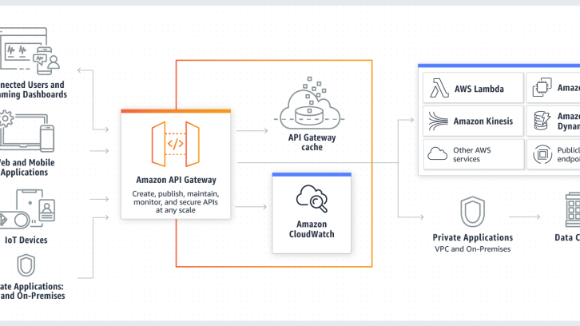

# API Gateway + Custom Authorizer 精细化权限控制

- 亚马逊AWS官方博客

** 2019 年 9 月 20 日

**[技术管理](https://www.infoq.cn/topic/management)[云计算](https://www.infoq.cn/topic/cloud-computing)[AWS](https://www.infoq.cn/topic/AWS)




大多数移动应用或者 Web 应用都有自己的用户身份认证体系。用户的身份信息存储在应用的自有数据库中, API Gateway 定义的不同的资源操作，需要根据应用的用户身份判断是否允许该用户访问这些不同的操作. 

例如，一个 bookstore app, 资源 URI 有/books, /books/{usesrid}, 具体的操作有/books/get, books/{userid}/get, books/{userid}/post 等等。 在这个应用中，如果用户的身份为 admin，则该用户可以执行所有操作。对于身份为 user 的用户，则只能访问 /books/{userid}下的所有操作。

对于这样的**基于用户身份进行 API 级别的权限控制**需求，需要通过自定义授权函数，通过应用的身份认证系统获取用户身份，基于用户身份以及当前执行的操作相结合，在自定义授权函数中判断用户是否有权限执行操作，并构建相应的权限策略返回给 API Gateway。


## 实验前提

1. 本文使用AWS控制台创建 RDS，API Gateway，Lambda 函数。假设您对使用控制台创建这些服务有一定的了解。
2. 本文 Demo 创建的 Lambda 函数会使用 环境变量，中国区 Lambda 暂时不支持环境变量，请选择Global Region。
3. 本文将使用RDS MySQL作为bookstore app的用户数据库。并使用客户端Workbench连接数据库，初始化表和数据, 请自行选择相应客户端工具。
4. 本文使用Postman 作为客户端测试工具，请自行安装。
5. 本文使用的开发语言是 Java，开发工具是 Eclipse，构建工具是 maven。如果需要在本地编译代码，请自行安装 JDK，Eclipse工具，并配置 maven。


> > > 本文用到的代码点击这里获取<<<<


## 服务介绍

Amazon API Gateway 是 AWS 的一项托管服务，可以**用于创建、发布、维护、监控和保护任意量级的 API，支持 REST 和 WebSocket 协议**。

通过 API Gateway，用户可以很容易的集成用户的后端服务，这个服务可以是 AWS 的相关托管服务，比如 Lambda 或者 S3，也可以用户运行在 EC2 中的自有服务。API Gateway 可以处理接受和处理多达数十万个并发请求，包括**流量管理、授权和访问控制、监控以及 API 版本管理**。

AWS Lambda 是一项无服务器计算服务，用户无需配置和管理服务器，只需要上传代码即可以运行代码。AWS Lamba 支持自动说法，支持每秒数千个并发请求。

Amazon RDS 是 AWS 托管的关系数据库服务，支持开源的 MySQL，Mariadb，Postgre SQL 数据库，商用的 Oracle 和 Microsoft SQL Server 数据库，同时还有 AWS 自研的高性能数据库 Aurora。其中，Aurora 兼容 MySQL 和 PostgreSQL 引擎，但是性能最多可以将 MySQL 吞吐量增加 5 倍，将 PostgreSQL 的吞吐量增加 3 倍。


## 架构原理


架构图

步骤 1: 客户端提交请求，访问 API gateway 接口。这里，假设用户已经登录自己的应用系统，并获取了 auth_token。 这里客户端提交的 API Gateway 地址类似如：

https://{apiid}.execute-api.ap-northeast-1.amazonaws.com/{stage}/books/{userid}

其中{apiid},{stage},{userid}在测试时根据实际情况替换


步骤 2: API Gateway 在转发客户端请求到后端服务之前，会调用自定义的授权函数：一个通过 Lambda 实现的自定义授权函数。在这里，API gateway 需要：

1. 创建授权方Authorizer,设定类型为Lamba，并指定自定义的Lambda函数：CustomAuth。
2. 配置所有资源方法，在方法的 Method Request 中设定Authorization 为我们创建的授权方：CustomAuth。
3. 步骤3,4: 在这里，自定义的 Lambda 授权函数的主要逻辑是：
4. 从输入上下文中获取 authToken：

```
String authToken = (String)input.getAuthorizationToken();
```


1. 根据authToken,访问应用的用户身份库，获取用户身份信息。在这里，通过查询存储在RDS MySQL中的用户信息表：

```
select user_id, role_name,user_name,auth_token, expire from user_auth where auth_token=?
```

1. 基于用户的身份信息，判断用户是否有权限访问该资源：如果用户角色是 admin，则返回允许访问所有资源的策略；如果用户角色是普通 user，如果用户访问的是自己的资源，则返回允许访问的策略，如果访问的是其他人的资源，则返回的是拒绝访问的策略 具体实现逻辑可以参照源码 : com.amazon.demo.auth.custom. CustomUserAuthorization

2. ```
   
   ```


if(logonUser == null)


return [AuthType.DENYALL.name](http://authtype.denyall.name/)();


String roleName =logonUser.getRoleName();	


if(roleName.equals([RoleType.admin.name](http://roletype.admin.name/)())) {


return [AuthType.ALLOWALL.name](http://authtype.allowall.name/)();


}


else if(roleName.equals([RoleType.user.name](http://roletype.user.name/)())) {


return [AuthType.ALLOWONE.name](http://authtype.allowone.name/)();


}


```
   步骤5: 自定义的 Lambda 授权函数将授权策略返回给API Gateway
1. 如果允许访问，该授权方函数将返回 200 OK HTTP 响应和 IAM 策略（类似于以下内容）并且方法请求成功
```

复制代码

{


“Version”: “2012-10-17”,


“Statement”: [


{


“Action”: “execute-api:Invoke”,


“Effect”: “Allow”,


“Resource”: “arn:aws:execute-api:us-east-1:123456789012:ivdtdhp7b5/ESTestInvoke-stage/GET/”


}


]


}


```
2.如果拒绝访问，该授权方函数将返回 403 Forbidden HTTP 响应和 Deny IAM 策略（类似于以下内容）并且方法请求失败
```

复制代码


{


“Version”: “2012-10-17”,


“Statement”: [


{


“Action”: “execute-api:Invoke”,


“Effect”: “Deny”,


“Resource”: “arn:aws:execute-api:us-east-1:123456789012:ivdtdhp7b5/ESTestInvoke-stage/GET/”


}


]


}


```
步骤6: API Gateway 评估授权策略
步骤7: 如果允许访问，则将请求转发给后端应用，并将调用返回的结果返回给客户端
步骤8: 如果拒绝访问，则返回客户端403 Forbidden HTTP 响应
通过自定义授权函数，可以实现基于应用的用户身份管理系统实现 API Gateway 的细粒度的授权控制，实现不同的用户基于自己在应用中的角色来访问 API Gateway中定义的资源和方法。
## Demo 部署步骤1: 登录控制台，创建应用自定义的用户身份信息数据库，并初始化数据：
1. 创建RDS MySQL，选择 private 访问，并记录下数据库 Endpoint,数据库名称，用户名，密码以及 VPC 和子网信息；2. 通过客户端工具Workbench（其他工具也可以），连接数据库，并执行初始化脚本（resources/user.table.sql）中 定义的 SQL
```

复制代码


CREATE TABLE user_auth (


id bigint(20) NOT NULL auto_increment,


user_id int(10) unsigned NOT NULL,


role_name varchar(10),


user_name varchar(10),


auth_token char(10),


expire long,


PRIMARY KEY (id)


) ENGINE=MyISAM DEFAULT CHARSET=UTF8;


insert into user_auth (user_id,role_name,user_name,auth_token)values(1,‘admin’,‘Admin1’,‘1111111111’);


insert into user_auth (user_id,role_name,user_name,auth_token)values(2,‘admin’,‘Admin2’,‘2222222222’);


insert into user_auth (user_id,role_name,user_name,auth_token)values(3,‘user’,‘User3’,‘3333333333’);


insert into user_auth (user_id,role_name,user_name,auth_token)values(4,‘user’,‘User4’,‘4444444444’);


insert into user_auth (user_id,role_name,user_name,auth_token)values(5,‘user’,‘User5’,‘5555555555’);


```
步骤2： 在控制台中选择 API Gateay，创建 API：book store
1. 创建 bookstore API：选择 REST， NEW API, API Name: bookstore, Endpoint Type: Regional并保存2. 创建/books 资源及/books/get 方法3. 创建Resource: Resource Name:books, resource path: /books4. 创建 /books资源get method,Integration Type选择 mock:
创建资源图这里，为了简化整个 demo 的复杂性，通过 mock 类型实现对用户的一个后端业务 API 的模拟。选择 Integration Response，展开默认的200状态，展开 Mapping Templates, 单击 application/json, 将mock response（resources/getall.json文件内容）贴入mapping template 输入框，并保存： 
3. 创建/books/{userid} 资源及/books/{userid}/get 方法
* 创建资源/books/{userid} 创建资源图* 创建/books/{userid}/get 方法，Ingetration Type 选择 mock* 选择 Integration Response，展开默认的200状态，展开Mapping Templates, 单击application/json, 将 mock 的 response（resources/userid.json文件内容） 贴入mapping template 输入框，并保存 步骤3: 创建自定义授权 Lambda 函数：CustomAuth
1. Function Name：CustomAuth, Runtime: Java 82. 上传 jar：resources/CustomAuth-0.0.1-SNAPSHOT.jar，设置 Handler： com.amazon.demo.auth.custom.CustomUserAuthorization::handleRequest，并保存. 这里的jar文件也可以使用在本地编译生产的jar包，jar包含所有的依赖库；3. Lambda选择和数据库同一个VPC，并设置安全组，开放3306端口；Lambda 角色需要 attach 策略：AWSLambdaVPCAccessExecutionRole4. 配置环境变量,环境变量不要加密* database_user: 创建数据库时的数据库用户名* database_password:创建数据库时设置的密码* database_url:URL类似如下: jdbc:mysql://{endpoint}:3306/{dbname}?useUnicode=true&characterEncoding=UTF-8
步骤4: 配置 API Gateway 的方法，设置 Authorization为Lambda 函数:CustomAuth
1. 登录控制台，选择 Authorizers，创建授权方指定 Type为 Lambda* Lambda Function 为我们创建的 Lambda 函数：CustomAuth* Lambda Invoke Role保留为空* Lambda Event Payload 设置为 Token* Token Source： tokenHeader* Authorization Caching: 不勾选 Enabled (这里，不缓存policy的原因是对于普通user角色的用户，他每次访问资源的时候，权限可能会变化，因此如果 缓存策略，可能会造成越权访问) 
2. 配置 API Gateway 的所有方法，设置Authorization Deploy API，阶段 test。并记录下 Invoke URL: https://h5khyegpm1.execute-api.cn-north-1.amazonaws.com.cn/test步骤5: 使用工具 Postman,测试 测试 GET 方法，Header 中增加 key：tokenHeader，value 根据下面具体场景
1.测试 身份为 admin 的用户，tokenHeader:1111111111访问资源： /books, 返回所有人的书籍 访问资源：/books/2，返回用户2拥有的书籍 2.测试 身份为 user的 普通用户，tokenHeader:3333333333访问资源： /books, 包含所有人书籍，拒绝访问 访问资源： /books/3, 允许访问，返回用户3拥有的书籍访问资源：/books/4,查询其他人的书籍，拒绝访问 ## 如何销毁资源1. 登录控制台，访问 RDS 页面，删除数据库2. 登录控制台，访问 Lambda 页面，删除 Lambda 函数3. 登录控制台，访问 API Gateway 页面，删除 API
## 参考文档使用 Java 构建 Lambda 函数
API Gateway-使用 Lambda 授权方
API Gateway 自定义授权方Java 实例代码
** 作者介绍：**
琚小龙琚小龙，AWS解决方案架构师，负责基于AWS的云计算方案架构咨询和设计，服务客户涵盖游戏，互联网，EDA, 生产制造。加入 AWS 之前，曾任职互联网创业公司以及惠普，拥有20年移动互联网、大型企业复杂应用的系统架构和设计经验。

张贝贝AWS 解决方案架构师
**本文转载自AWS博客。**
**原文链接：**https://amazonaws-china.com/cn/blogs/china/api-gateway-custom-authorizer/
```


2019 年 9 月 20 日 08:30546


亚马逊AWS官方博客

发布了 1191 篇内容， 共 25.3 次阅读， 收获喜欢 15 次。