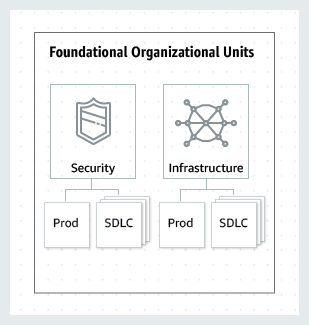
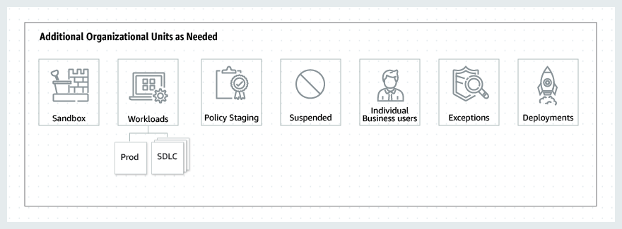

# 建立最佳实践AWS环境

### 为什么要设置多账户AWS环境？

通过AWS，您可以更快地进行实验，创新和扩展，同时提供最灵活，最安全的云环境。**AWS帐户是AWS确保您应用程序安全的重要手段**。**一个AWS账户为您的AWS资源提供天然的安全性，访问权限和账单边界，并使您能够实现资源独立性和隔离性**。例如，**默认情况下，您帐户以外的用户无权访问您的资源**。同样，您消耗的AWS资源的成本也会分配给您的账户。虽然您可以使用单个帐户开始AWS之旅，但是**AWS建议您随着工作量的规模和复杂性的增加设置多个帐户**。

使用多账户环境是AWS的最佳实践，它具有以下优点：

- **具有各种要求的快速创新**–您可以**将AWS账户分配给公司内的不同团队，项目或产品**，以确保他们每个人都可以快速创新，同时满足自己的安全要求。
- **简化的账单**–使用多个AWS账户，可以帮助**确定哪个产品或服务线负责AWS收费，从而简化了您分配AWS成本的方式**。
- **灵活的安全控制**–您可以**使用多个AWS账户来隔离具有特定安全要求，或需要满足严格合规性准则（例如HIPAA或PCI）的工作负载或应用程序**。
- **轻松适应业务流程**–您可以轻松地**组织多个AWS账户，以最能反映公司业务流程的多样化需求**，这些需求**具有不同的运营，法规和预算要求**。

最终，多账户AWS环境使您能够使用云来更快地移动并构建差异化的产品和服务，同时确保以安全，可扩展和有弹性的方式做到这一点。但是，您应该如何构建多账户AWS环境？您可能会有疑问，例如要使用哪种帐户结构，应实施哪些策略和防护栏，或者如何设置审核环境。

本指南的其余部分将带您逐步了解构建安全高效的多账户AWS环境的要素，AWS建议将其通常称为“着陆区”。这代表了可用于构建初始框架的最佳实践，同时随着您的AWS工作负载随时间增加而仍然具有灵活性。

### 设置多账户AWS环境的最佳实践

架构良好的多账户AWS环境的基础是[AWS Organizations](https://aws.amazon.com/organizations/)，这是一项AWS服务，使您能够集中管理和治理多个账户。在开始之前，让我们熟悉一些术语。

- 组织单位（OU）：是AWS**组织中帐户的逻辑分组**。OU使您可以**将帐户组织到一个层次结构中，并使您更容易管理控制手段**。
- AWS Organizations[策略](https://docs.aws.amazon.com/organizations/latest/userguide/orgs_manage_policies.html)：是您用来**应用此类控制的策略**。
- [服务控制策略](https://docs.aws.amazon.com/organizations/latest/userguide/orgs_manage_policies_scp.html)（SCP）：是用于**定义组织中的帐户可以执行的AWS服务操作（例如Amazon EC2运行实例）的策略**。

首先，考虑应该创建哪些帐户分组或OU。您的**OU应该基于功能或通用的控制集，而不是复制公司的组织报告结构**，AWS建议您**首先考虑安全性和基础架构**。大多数企业都有集中的团队，可以为整个组织提供这些需求。因此，我们建议为这些特定功能创建一组基础OU：

- 基础结构：用于共享基础结构服务，例如网络和IT服务。**为所需的每种基础结构服务类型创建帐户**。
- 安全性：用于安全服务。创建用于日志归档、安全只读访问、安全工具和break-glass的帐户。

**鉴于大多数公司对生产工作负载有不同的策略要求，因此基础结构和安全性可以具有用于非生产（SDLC）和生产（Prod）的嵌套OU**。

- SDLC OU中的帐户托管非生产工作负载，因此不应具有其他帐户的生产依赖性。如果生命周期阶段之间的OU策略存在差异，则SDLC可分为多个OU（例如dev和pre-prod）。
- 产品OU中的帐户托管生产工作负载。

在OU级别上应用策略，以根据您的要求管理Prod和SDLC环境。通常，**在OU级别应用策略比在单个帐户级别应用策略更好，因为它简化了策略管理和任何潜在的故障排除**。

一旦中央服务就绪，我们建议创建与构建或运行产品或服务直接相关的OU。建立基础后，许多AWS客户都会构建这些OU。

- **沙箱**：拥有可供单个开发人员用来试用AWS服务的AWS帐户。确保可以将这些帐户与内部网络分离，并设置流程来限制支出，以防止过度使用。
- **工作负载**：包含托管您的外部应用程序服务的AWS账户。您应该在SDLC和Prod环境下构造OU（类似于基础OU），以便隔离和严格控制生产工作负载。

现在已经建立了基本的和面向生产的OU，我们建议根据您的特定需求添加其他OU，以进行维护和持续扩展。这些是基于现有AWS客户的实践的一些常见主题：

- **策略分阶段**：持有AWS账户，您可以在其中测试建议的策略更改，然后将其广泛应用于组织。首先在预期的OU中在帐户级别实施更改，然后逐步解决其他帐户，OU以及整个组织的其余部分。
- **已暂停**：包含已关闭并且正在等待从组织中删除的AWS账户。将SCP附加到此OU，以拒绝所有操作。如果需要还原帐户，请确保为帐户[标记](https://docs.aws.amazon.com/organizations/latest/userguide/orgs_tagging.html)了详细信息以进行追溯。
- **单个业务用户**：访问受限的OU，其中包含可能需要创建与业务生产力相关的应用程序（例如，设置S3存储桶以与合作伙伴共享报告或文件）的业务用户（而非开发人员）的AWS帐户。
- **例外**：持有用于业务用例的AWS账户，这些账户具有高度自定义的安全性或审核要求，与Workloads OU中定义的要求不同。例如，专门为机密的新应用程序或功能设置一个AWS账户。在帐户级别使用SCP来满足定制需求。考虑使用CloudWatch Events和AWS Config Rules设置Detect and React系统。
- **部署**：包含**用于CI / CD部署的AWS账户**。如果与工作负载OU（产品和SDLC）中的帐户相比，如果CI / CD部署具有不同的治理和运营模型，则可以创建此OU。**CI / CD的分发有助于减少组织对中央团队操作的共享CI / CD环境的依赖性**。对于工作负载OU中针对应用程序的每组SDLC / Prod AWS账户，在Deployments OU下创建CI / CD账户。

### 结论

精心设计的多账户策略可帮助您在AWS中更快地进行创新，同时确保满足安全性和可扩展性需求。本页描述的框架代表了AWS最佳实践，您应该将其用作AWS旅程的起点。

要开始使用，请参阅《 AWS Organizations[入门指南》](http://docs.aws.amazon.com/organizations/latest/userguide/orgs_getting-started.html)以构建自己的多账户AWS环境。或者，您可以使用[AWS Control Tower](https://aws.amazon.com/controltower/)来帮助您单击几下快速建立安全的初始AWS环境。

### 其他资源

- 博客文章：“ [AWS组织的组织单位的最佳做法](https://aws.amazon.com/blogs/mt/best-practices-for-organizational-units-with-aws-organizations/?org_product_gs_bp_OUBlog)”
- 博客文章：“[建立云存在时的治理，风险和合规性](https://aws.amazon.com/blogs/mt/governance-risk-and-compliance-when-establishing-your-cloud-presence/?org_product_gs_bp_governance)”
- AWS re：Invent 2019：在您的着陆区（SEC325）[YouTube](https://www.youtube.com/watch?v=zVJnenaD3U8) 或[幻灯片上](https://d1.awsstatic.com/events/reinvent/2019/REPEAT_2_Architecting_security_&_governance_across_your_landing_zone_SEC325-R2.pdf)设计安全性和治理
- AWS Organizations[常见问题解答](https://aws.amazon.com/organizations/faqs/?org_product_gs_bp_faq)，[文档](https://aws.amazon.com/documentation/organizations/?org_product_gs_bp_documentation)和[API参考](http://docs.aws.amazon.com/organizations/latest/APIReference/Welcome.html?org_product_gs_bp_api)
- AWS Control Tower[常见问题](https://aws.amazon.com/controltower/faqs/?org_product_gs_bp_controltower) 和[文档](https://docs.aws.amazon.com/controltower/latest/userguide/what-is-control-tower.html?org_product_gs_ctdocumentation)

原文：https://aws.amazon.com/cn/organizations/getting-started/best-practices/