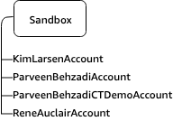

# AWS组织的组织单位的最佳实践

由 Sam Elmalak | 上 2020年7月21日| 在 [AWS机构](https://aws.amazon.com/blogs/mt/category/security-identity-compliance/aws-organizations/)，[最佳实践](https://aws.amazon.com/blogs/mt/category/post-types/best-practices/)，[管理工具](https://aws.amazon.com/blogs/mt/category/management-tools/)

在启动新业务创新时，AWS客户希望快速安全地移动。**多账户框架提供了指导，以帮助客户规划其AWS环境**。该框架旨**在满足安全需求，同时保持根据不断变化的业务需求扩展和适应其环境的能力**。架构良好的多账户AWS环境的基础是[AWS Organizations](https://aws.amazon.com/organizations/)，这是一项AWS服务，使您能够集中管理和管理多个账户。

在考虑建立组织时，本文深入探讨了推荐的AWS最佳实践架构。它将解释和说明建议的OU结构，并提供具体的实现示例。如果您对这些概念有较高的了解，建议您查看“[建立最佳实践AWS环境”](https://aws.amazon.com/organizations/getting-started/best-practices/)页面。

## 为什么要设置多账户AWS环境？

AWS使您能够更快地进行实验，创新和扩展，同时提供灵活，安全的云环境。在客户构建和部署工作负载时，他们需要机制来隔离其资源（即资源容器），并且可以使用多个AWS账户来实现。**一个AWS账户为您的AWS资源提供自然的安全性，访问权限和计费边界，并使您能够实现资源独立性和隔离性**。例如，**默认情况下，您帐户以外的用户无权访问您的资源**。同样，您消耗的AWS资源成本仅分配给您的账户。虽然您可以使用单个帐户开始AWS之旅，但**随着工作负载的规模和复杂性增加，AWS建议您设置多个帐户**。

- 具有各种要求的快速创新：您可以**将AWS账户分配给公司内的不同团队，项目或产品**。独立的帐户提供了一种快速创新的机制，同时可以满足独特的安全要求。
- 简化的账单：**使用多个AWS账户可以帮助您确定哪个产品或服务系列负责AWS收费，从而简化了您分配AWS成本的方式**。
- 灵活的安全控制：您可以**使用多个AWS账户来隔离具有特定安全要求，或必须满足严格合规性准则的工作负载或应用程序**，例如HIPAA或PCI DSS。
- 轻松适应业务流程：您可以轻松地**组织多个AWS账户，以最能反映公司业务流程的各种需求，例如不同的运营，法规和预算要求**。

最终，多账户AWS环境使您能够使用云来更快地移动并构建差异化的产品和服务，同时提供以安全，可扩展和有弹性的方式实现此目的的机制。但是，您应该如何构建多账户AWS环境？您可能会有疑问，例如要使用哪种帐户结构，要实施哪些策略和防护栏，或者如何设置审核环境。

在本文中，我们将带您逐步了解构建安全且高效的多账户AWS环境的要素，AWS建议将其称为“着陆区”。这代表了可用于构建初始框架的最佳实践，同时随着您的AWS工作负载随时间增加而仍然具有灵活性。

## 设置多账户AWS环境的最佳实践

在开始之前，让我们熟悉一些术语。

- 组织单位（OU）：是AWS组织中**帐户的逻辑分组**。**OU使您可以将帐户组织到一个层次结构中，并使您更容易管理控制手段**。
- AWS Organizations策略：是您用来**应用此类控制的策略**。
- 服务控制策略（SCP）：是用于**定义组织中的帐户可以执行的AWS服务操作（例如Amazon EC2运行实例）的策略**。

构建此结构时，关键原则是减少管理该结构的操作开销。为此，我们将整体层次结构的深度以及应用策略的位置最小化。例如，**服务控制策略（SCP）主要应用于OU级别，以简化故障排除过程，而不是帐户级别**。下面介绍了此方法的任何例外情况。

首先，考虑应该创建哪些帐户分组或OU。**OU允许您根据功能组织帐户，应用通用策略以及组织AWS帐户，以便更轻松地在类似的AWS帐户之间共享集中管理的资源**。您的**OU应该基于功能或一组通用控制，而不是复制公司的组织报告结构**。

### 产品和软件开发生命周期（SDLC）

在深入了解基本OU之前，让我们考虑如何实现软件开发生命周期。鉴于大多数公司对生产工作负载有不同的策略要求，因此某些OU可以具有用于非生产（SDLC）和生产（prod）的嵌套OU。

- SDLC OU中的帐户：**托管非生产帐户，即开发，测试和预生产**。他们不应具有其他帐户的生产依存关系。
- 顾名思义，Prod OU中的帐户：**托管生产工作负载**。

对于客户未开发的应用程序和服务，SDLC帐户可以为登台环境建模。例如，可以在SDLC OU下的dev环境中托管现成产品，而在Workloads OU中的“ prod” OU下将prod帐户托管在产品环境中。

客户可能**可以创建一个SDLC OU来托管帐户的所有开发阶段**，但是，如果生命周期之间的OU策略存在差异，则SDLC OU可以替换多个OU，例如Dev OU和PreProd OU。无论如何，**通常应该存在一个单独的Prod OU来承载生产工作负载**。

根据您的要求，**在OU级别上应用策略来管理Prod和SDLC环境**。通常，建议**在OU级别而不是在单个帐户级别应用策略，因为这可以简化策略管理和任何潜在的故障排除**。

### 基础OU

AWS建议您首先考虑安全性和基础架构。大多数企业都有集中的团队，可以为整个组织提供这些需求。因此，我们建议为这些特定功能创建一组基础OU，分为基础结构和安全OU。

### OU：基础架构

**基础结构**：**用于共享基础结构服务，例如网络和IT服务**。**为所需的每种基础结构服务类型创建帐户**。

示例：客户拥有三个共享的基础结构和网络服务，它们提供对公司网络的访问，使用RabbitMQ（消息总线服务）的托管消息服务以及一个通用的共享基础结构帐户。OU和帐户结构如下所示：

 

### OU：安全

安全OU**用于托管与安全性相关的访问和服务**。安全OU，其子OU和关联的AWS账户应由您的安全组织拥有和管理。

### 推荐帐户

**日志存档**：一个AWS帐户，用作**从您环境中的所有AWS帐户收集的面向安全性的AWS访问和审核日志的合并点**。

**安全性ReadOnlyAccess**（人工）：此AWS账户的目的是使您的**安全团队成员能够以只读权限访问AWS环境中的其他AWS账户，以支持审核，探索性安全性测试和调查**。例如，在调查可疑的安全事件的早期阶段，您的安全团队成员将首先访问此AWS账户并使用只读的IAM跨账户角色，然后访问其他AWS账户以查看和监视资源状态。

**Security Breakglass**（人员）：一个很少使用的AWS帐户，但是在发生安全事件时可供您的安全团队成员使用。通过该帐户，可以对您的AWS帐户进行广泛的写访问。**在事件开始时，安全团队成员需要获得特殊授权才能获得访问权限**。**解决事件后，将撤消临时访问权限**。所有访问将被详细记录。

**安全工具**（最低人数）：一个或多个AWS账户，可托管广泛适用的面向安全的工作负载以及服务，工具和支持数据。在此账户中配置的工具和服务的常见示例包括[Amazon GuardDuty](https://aws.amazon.com/guardduty/)主账户，[AWS Security Hub](https://aws.amazon.com/security-hub)主账户，[Amazon Detective](https://aws.amazon.com/detective/)主帐户以及第三方云安全监控服务和工具。**应尽量减少出于管理目的而对这些AWS账户的人工访问，以利于使用基础架构即代码（IaC）和其他自动化技术**。在需要直接人工管理的地方，授权管理员需要足够的写权限。除了管理访问权限之外，可能还需要其他人员访问权限，以便安全团队成员可以与安全服务进行交互并可能配置安全服务的功能。

###### 

一旦中央服务就绪，我们建议创建与构建或运行产品或服务直接相关的OU。建立基础后，许多AWS客户都会构建下面列出的OU。

### OU：沙盒

该OU**用于各个技术人员的AWS账户，他们可以在其中学习和深入研究AWS服务**。

**建议将此沙箱中的帐户与客户的内部网络分离。要访问AWS服务，必须访问Internet，但建议对此加以限制**。还考虑这些帐户的固定支出限制，例如每月100美元，并报告给领导层，以跟踪异常值和过度使用情况。

例如，客户为其所有员工提供沙盒帐户：

###### 

### OU：工作负载

这些是**用于创建软件生命周期的AWS账户的OU**。

**建议创建工作负载帐户以隔离软件服务，而不是映射到客户团队，以使部署的应用程序更能适应组织的变化**。**将一组帐户的访问权从一个团队转移到另一个团队很容易，而将软件服务从一个帐户转移到另一个帐户则是一项艰巨的任务**。

SDLC /非产品OU中的帐户旨在用于暂存软件服务，并且不应依赖于其他OU。其他附加OU中的帐户应仅取决于工作负载/产品OU帐户。

示例：客户拥有三个不同的业务部门，制造，消费者服务和市场营销，所有这些部门共享治理和运营模型。消费者服务部有一个公共Beta，而OU没有。在这种情况下，建议具有以下结构：

###### 

在此过程的这一点上，已经建立了基本的和面向业务的OU，您可以开始您的云之旅。这是起始框架：

我们建议根据您的特定需求添加其他面向业务的OU，以进行维护和持续扩展。这些是基于现有AWS客户的实践的一些常见主题：

### OU：PolicyStaging

在对AWS组织进行策略或结构更改时，重要的是在广泛应用更改之前验证您的更改。为了验证更改，管理员需要能够以不影响生产的方式构建和应用他们想要进行的更改。**组织单位“ OU：PolicyStaging”是非生产OU，它为组织管理员提供了测试提议的OU设置，验证应用策略的结果**。

**建议创建子OU和帐户以验证变更**。一旦更改通过了验证，就可以采用rollout部署策略将变更一步步应用于更多的组织。**以最低级别的目标帐户上开始部署，在组织内进一步推进变更，以这种方式进行更改将最小化可能的爆炸半径**。

示例：策略团队正在管理有关安全性、基础结构、工作负载、代码和部署的策略。要分阶段进行，它们具有以下结构：

###### 

### OU：已暂停

包含已关闭且正在等待从组织中删除的AWS账户。将[服务控制策略](https://docs.aws.amazon.com/organizations/latest/userguide/orgs_manage_policies_type-auth.html)（SCP）附加到此OU，以拒绝所有操作。如果需要还原帐户，请确保为帐户[标记](https://docs.aws.amazon.com/organizations/latest/userguide/orgs_tagging.html)了详细信息以进行追溯。

以前员工拥有的帐户和即将退休的帐户应移至“已暂停”。帐户应标明详细信息，例如它们的来源，以防需要恢复以及出于可追溯性原因。

关闭了90天的帐户将被永久删除，此后该帐户及其资源将无法恢复。已关闭的帐户在您的组织中可见，处于“已暂停”状态。帐户被永久删除后，在您的组织中将不再可见。

有关关闭账户的更多详细信息，请访问[关闭AWS账户文档](https://docs.aws.amazon.com/organizations/latest/userguide/orgs_manage_accounts_close.html)。

### OU：IndividualBusinessUsers

受限访问OU，其中包含非技术人员的业务用户的AWS账户。这些用户可以创建与业务生产力相关的应用程序，例如，设置S3存储桶以与合作伙伴共享报告或共享文件。

### OU：例外

在某些情况下，业务用例需要在OU：Workloads下定义的安全性或审核条件下例外。当识别出这些情况之一时，可以准予例外。在这种情况下，将为帐户提供定制的安全立场。OU：Exception下的帐户由于其用例的自定义性质，将SCP直接应用于该帐户而不是OU。由于自定义的预防性控制措施，这些帐户的所有者还可以期望对现有的检测和反应系统（[Amazon CloudWatch](http://aws.amazon.com/cloudwatch) Events，[AWS Config](https://aws.amazon.com/config/) Rules等）进行更严格的审查。

例如，绝密项目是一种特殊情况，可能属于“例外” OU。最终，这取决于为合规性和安全性定义了哪些SCP，以及新产品能否在相关SCP定义的准则内发布。如果围绕新计划所需的安全性太严格，以至于人们认为需要建立一个新的独立组织，那么将来迁移回主要组织中就会增加风险和成本。

### OU：部署

包含用于CI / CD部署的AWS账户。如果与用于工作负载OU（产品和SDLC）中的帐户相比，如果您具有不同的CI / CD部署管理和运营模型，则可以创建此OU。CI / CD的分发有助于减少组织对中央团队操作的共享CI / CD环境的依赖性。对于工作负载OU中针对应用程序的每组SDLC / Prod AWS账户，在Deployments OU下创建CI / CD账户。

CI / CD部署管道可以是AWS CodeX服务或自托管服务。建议以与其构建和部署的软件服务的运营模型相匹配的方式分发CI / CD。

非生产OU中的帐户旨在用于暂存CI / CD服务，并且不应与其他OU具有依赖性。

示例：客户有三个不同的业务部门。制造业（具有工业物联网服务，并通过自己的运营模型进行自治）、消费服务和营销，共享治理和运营模型。在这种情况下，建议具有以下OU和帐户：

建议将CI / CD部署OU分为不同的层次结构和AWS账户，因为两者之间的治理和运营模型有所不同。

对于每个要构建的服务，将在Teams OU下创建与开发生命周期匹配的帐户。生产阶段将在OU：Workloads / OU：Prod下。开发生命周期的所有其他阶段将在OU：Workloads / OU：SDLC下。

**对于每个服务（即一组SDLC帐户），将有一个相应的部署帐户**。该帐户位于OU：Deployments下。例如，如果名为foo的服务具有dev，beta，QA和生产，则其整体环境将配置如下：

 

现在，我们已经建立了附加的OU和帐户。

## 结论

精心设计的多账户策略可帮助您在AWS中更快地进行创新，同时帮助您满足安全性和可扩展性需求。本博客文章中描述的框架代表了AWS最佳实践，您应该将其用作AWS旅程的起点。

要开始构建自己的环境，请参阅《[AWS Organizations入门指南》](https://aws.amazon.com/organizations/getting-started/)。或者，您可以使用[AWS Control Tower](https://aws.amazon.com/controltower/)来帮助您单击几下快速建立安全的初始AWS环境。

 

### 关于作者

Sam Elmalak是AWS的WW技术负责人，并且是AWS安全社区的成员。除了帮助客户解决技术问题外，他还帮助客户应对组织的复杂性并应对文化挑战。Sam致力于使团队能够应用技术来解决业务挑战和未满足的需求。他在很大程度上是一个乐观主义者，并且相信人们能够蓬勃发展并取得令人惊奇的成就。

TAGS： [AWS多账户管理](https://aws.amazon.com/blogs/mt/tag/aws-multi-account-management/)，[AWS组织](https://aws.amazon.com/blogs/mt/tag/aws-organizations/)，[集中管理](https://aws.amazon.com/blogs/mt/tag/centralized-management/)

原文：Best Practices for Organizational Units with AWS Organizations

https://aws.amazon.com/cn/blogs/mt/best-practices-for-organizational-units-with-aws-organizations/?org_product_gs_bp_OUBlog

##### [AWS管理与治理博客](https://aws.amazon.com/blogs/mt/)