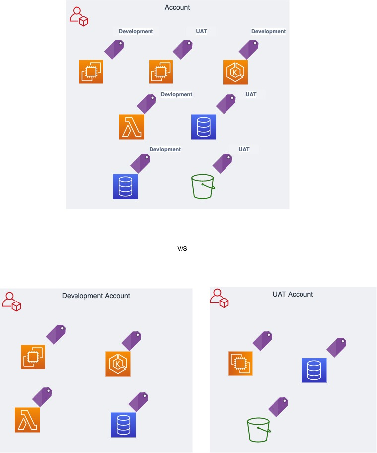
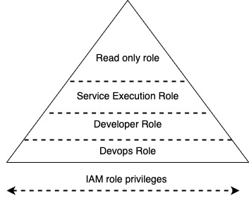
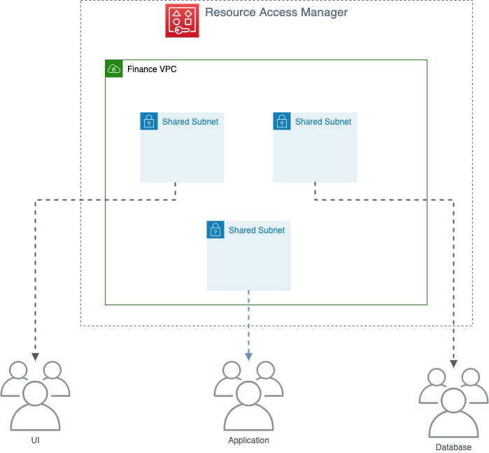

# 现场说明：FactSet如何使用“微型帐户”减少开发人员的摩擦并保持大规模安全性

Tarik Makota和Amit Borulkar设计的| 上 2021年1月21日| 在 [建筑](https://aws.amazon.com/blogs/architecture/category/architecture/)，[AWS身份和访问管理（IAM） ](https://aws.amazon.com/blogs/architecture/category/security-identity-compliance/aws-identity-and-access-management-iam/)，[客户解决方案](https://aws.amazon.com/blogs/architecture/category/post-types/customer-solutions/)，[DevOps的](https://aws.amazon.com/blogs/architecture/category/devops/)

*这篇文章是由FactSet的云基础架构团队，Gaurav Jain，Nathan Goodman，Geoff Wang，Daniel Cordes，Sunu Joseph和AWS解决方案架构师，Amit Borulkar和Tarik Makota共同撰写的。*

[FactSet](https://www.factset.com/)认为开发人员自助服务和DevOps对于实现云优势至关重要。作为他们采用云的过程的一部分，他们希望开发人员在保持其云环境的标准化和安全性的同时，拥有顺畅的基础架构供应经验。为了实现其目标，他们使用了所谓的“**微型帐户方法**”。**在他们的microAccount方法中，每个AWS账户均分配给一个项目，并由一个团队拥有**。

在此博客中，我们将介绍FactSet如何使用microAccounts方法大规模管理1000多个AWS账户。首先，我们介绍了它们方法的核心概念。然后，我们概述它们如何管理访问和权限。最后，我们展示了他们如何管理其网络实施以及如何使用自动化来管理其AWS Cloud基础架构。


## FactSet如何开始于AWS

他们以现在称为“**宏帐户**”方法的方式开始了云采用之旅。在早期，他们会建立少量的AWS账户。然后，这些**宏帐户在多个不同的应用程序团队和项目中共享**。他们拥有数百个应用程序团队以及数千名开发人员，他们很快就经历了macroAccounts方法的挑战。其中包括：

1. **为了保持最小特权，[AWS身份和访问管理（IAM）](https://aws.amazon.com/iam/)策略和资源标记的设计很复杂**。

   例如，如果开发人员需要启动/停止[Amazon EC2](https://aws.amazon.com/ec2/)实例的功能，则他们需要确保仅限于启动/停止自己的实例。随着开发人员希望使用[AWS Lambda](https://aws.amazon.com/lambda/)函数和容器之类的结构来自动化其工作流程，这种复杂性一直在增加。

2. **在跨部门正确分配云成本方面遇到困难**。更重要的是，他们不断前进：**我们如何围绕小组，项目或团队的支出建立问责制和透明度**？

3. **很难跟踪和管理基础结构变更对FactSet应用程序的影响**。例如，底层安全组或IAM策略的维护如何影响FactSet应用程序？

4. **在单个AWS账户下管理各种应用程序的服务配额和限制方面，需要付出巨大的努力**。


## FactSet的解决方案– microAccounts

认识到这些问题后，他们决定采用其他方法进行AWS账户管理。他们决定不创建几个共享的宏账户，而是决定**为每个项目创建一个AWS账户（microAccounts），并明确定义所有权和产品分配**。

打个比方，可能是**宏观账户就像是打开一扇房子的大门，而锁住单个壁橱和房间以限制出入**。这与保障进入房屋的安全性相反，但是在很大程度上**将各个壁橱和房间留给租户管理**。

### 微型账户的好处

他们使用microAccounts运营AWS云基础设施已有大约两年的时间。

microAccount方法的好处包括：

1.**访问和权限**：**通过将帐户与项目关联，简化了允许哪些服务，开发团队可以访问哪些资源，并能够确保这些权限正确地级联到基础资源**。下图显示了他们的microAccount策略。



图1 –标记与微帐户策略

2.**服务配额和限制**：鉴于**大多数服务配额是特定于帐户的**，因此microAccounts允许其开发人员根据其应用程序需求来计划限制。**在共享帐户配置中，没有机制来限制单独的团队使用过多的服务配额，而使其他团队的资源更少**。这些限制超出了基础架构配置的范围，可以执行Lambda并发，参数存储的API节流限制等运行时任务。

3.**AWS服务权限**：microAccounts允许FactSet轻松实现跨服务的最低特权。**通过使用IAM服务控制策略（SCP），它们限制了帐户可以访问的AWS服务**。它们从一组默认服务开始，根据业务需求，我们可以授予特定帐户对其他非常见服务的访问权限，而不必担心这些服务会渗入其他用例。

例如，它们默认情况下禁用存储网关，但是如果需要，可以允许访问特定帐户。

4.**爆炸半径遏制**：microAccounts**提供了创建安全边界的功能**。这是**在出现任何稳定性和安全性问题的情况下，它们在该特定应用程序（AWS帐户）中保持隔离状态，并且不影响其他应用程序的操作**。

5.**成本归因**：**明确定义的帐户所有权提供了一种简单明了的方法来将成本归因于特定的团队、项目或产品**。他们不必出于成本目的而强制标记单个资源。AWS帐户的行为类似于应用程序资源组，因此该帐户中的所有资源都被隐式标记。

6.**帐户通知和操作**：单线程帐户所有权允许FactSet自动将任何必需的通知转发给正确的开发人员。此外，由于帐户所有权是定义允许谁访问帐户的基础，因此与仅依赖标记相反，对该映射的有效性有很高的信心。

7.**帐户标准和扩展**：我们通过CI / CD管道管理microAccounts，这使我们能够进行标准化和扩展而不会受到干扰。

例如，所有微帐户都配备了标准的AWS Key Management Service（AWS KMS）密钥，AWS Backup Vault和策略，私有Amazon Route 53区域，AWS Systems Manager参数存储以及Terraform或AWS CloudFormation模板的网络信息。

8.**开发人员经验**：microAccount自动化和防护栏使开发人员可以快速入门，而**不必花费时间调试诸如正确的SCP / IAM权限等内容**。**开发人员倾向于跨多个应用程序工作**，并且由于对AWS环境有一套标准的期望，因此他们的经验得到了改善。当它们从一个应用程序迁移到另一个应用程序时，这特别有用。

### microAccount的访问权限

FactSet**使用标准的IAM角色和权限集创建每个AWS账户**，**每个帐户都有自己的SCP，该SCP定义了帐户中允许的服务列表**。根据应用程序的需求，他们可以扩展权限。**交互式角色被映射到ActiveDirectory（AD）组，并且AD组的成员资格由开发团队自己管理**。

标准角色是：

- **DevOps角色**–用于配置和管理基础结构的交互式角色。
- **开发人员角色**–用于读取/写入数据（和某些基础结构）的交互式角色
- **只读角色**–具有对帐户的只读访问权限的交互式角色。可以授予客户主管、产品开发人员和其他类似角色。
- **支持角色**–某些管理团队的交互式角色，以在需要时协助帐户所有者
- **ServiceExecutionRole** –可以附加到诸如Lambda函数，CodeBuild，EC2实例之类的实体的角色，并且对开发人员角色具有类似的权限。



图2 – IAM角色权限

### 微型帐户联网

- FactSet利用[AWS资源访问管理器](https://aws.amazon.com/ram/)（RAM）与每个帐户共享适当的子网。配置的每个microAccount都可以通过唱歌AWS Shared VPC来访问子网。他们在每个区域的每个业务单位的每个环境（开发，生产，UAT和共享服务）中创建一个VPC。RAM使他们能够轻松，安全地与[AWS组织](https://aws.amazon.com/organizations/)内的任何AWS账户共享AWS资源。创建帐户后，他们会为该帐户分配适当的子网。
- 他们使用[AWS Transit Gateway](https://aws.amazon.com/transit-gateway/)管理一个区域中多个VPC之间的VPC间路由和通信。他们不想限制我们快速扩展的能力。AWS Transit Gateway是一个在每个区域中放置其[AWS Direct Connect](https://aws.amazon.com/directconnect/)电路的地方。它为它们提供了一个整合的场所，以管理连接时传播到每个VPC的路由表。


图3 –微帐户的VPC共享

### MicroAccounts的自动化和配置管理

为了尽早创建无摩擦的自助式云基础架构，FactSet意识到自动化是必须的。他们的基础设施自动化使用源代码控制作为定义每个microAccount的真实来源。这有助于他们确保可重复和标准化的帐户设置流程，以及根据每个帐户需求灵活调整特定设置和权限的灵活性。



图4 –帐户配置流程

默认情况下，仅在少数区域中启用其帐户。他们通过以下策略块对其进行控制。如果他们添加新的区域，他们将在源代码管理中实施该更改，并且自动执行检查会将其添加到SCP。

```json
{
    "Sid": "DenyOtherRegions",
    "Effect": "Deny",
    "Action": "*",
    "Resource": "*",
    "Condition": {
        "StringNotEquals": {
            "aws:RequestedRegion": ["us-east-1","eu-west-2"]
        },
        "ForAllValues:StringNotLike": {
            "aws:PrincipalArn": [
                "arn:aws:iam::*:role/cloud-admin-role"
    }
}
```

JSON格式


## 得到教训

在采用microAccounts的过程中，FactSet遇到了一些新的挑战，值得一提：

1. **IAM角色创建**：他们的DevOps角色可以在帐户中创建新的IAM角色。为确保新创建的角色符合最小特权原则，它们附加了标准权限边界，该边界限制了其权限不得超出DevOps级别。
2. **账户删除**：尽管AWS提供了用于账户创建的API，但是目前没有用于删除或重命名账户的API。这不是问题，因为例如由于取消了项目，只需要删除一小部分帐户。
3. **帐户创建/服务激活**：尽管使用自动化来配置帐户，但要完全激活帐户中的所有服务仍需要一些时间。某些服务（如[Amazon EC2）](https://aws.amazon.com/ec2/)具有要在新帐户中激活的异步流程。
4. **帐户电子邮件，root密码和MFA**：创建帐户后，他们不会设置root密码或MFA。仅在主（主）帐户上进行设置。鉴于每个帐户都需要一个唯一的电子邮件地址，因此他们利用[Amazon Simple Email Service](https://aws.amazon.com/ses/)（Amazon SES）来创建一个新的电子邮件地址，云管理员团队将其作为收件人。当需要以root用户身份登录时（非常不寻常），他们将在登录之前经历密码重置过程。
5. **服务控制政策**：与SCP相关的主要挑战有两个：
   - SCP是附属于儿童microAccount的主（主）帐户中的资产。但是，他们还希望像其他任何帐户配置一样管理SCP，并将其与其他帐户配置一起存储在源代码控制中。我们的自动化系统需要使用IAM角色来拥有特殊权限，以便能够在主（主）帐户中创建/附加/分离SCP。
   - 主（主）帐户的硬限制为1000个SCP。如果每个帐户都有一个SCP，那么您将只能使用1000个微型帐户。他们通过在具有相同策略的帐户之间重复使用SCP来解决了这一问题。对策略的内容进行哈希处理以创建唯一的SCP标识符，并将具有相同哈希值的帐户附加到同一SCP。
6. **在微型帐户之间共享数据（通常为S3**）：它们利用“可信帐户”的概念来允许其他帐户访问帐户的资源，包括S3和KMS密钥。
7. 对于单个项目而不是共享池，拥有静态成本的资源（如应用程序负载平衡器（ALB）和KMS）可能感觉像是一种反模式。具有基本成本的资源列表很小，因为大多数服务在很大程度上是根据使用情况定价的。对于FactSet，资源隔离是microAccounts的主要优势，因此超过了其中一些增加的成本。
8. **中央库存和日志记录**：拥有数百个账户，值得投资于更集中的库存和[AWS CloudTrail](https://aws.amazon.com/cloudtrail/)日志收集系统。
9. **成本，预留实例（RI）和节省计划**：FactSet发现，您的主（主）账户级别的[AWS Cost Explorer](https://aws.amazon.com/aws-cost-management/aws-cost-explorer/)是实现成本透明的绝佳工具。他们利用AWS Cost Explorer的API将数据导入其内部成本透明性工具。RI和储蓄计划是集中管理的，并利用同一主（主要）组织内帐户之间的自动共享。


## 结论

microAccounts方法为FactSet提供了敏捷性，使其能够根据企业中不同团队和项目的特定需求进行操作。他们目前正在十二个AWS区域中进行部署，几分钟之内即可完成自动AWS账户预配置，并且全天执行多次偏移检查。这使他们的开发人员可以腾出精力专注于解决业务问题，以最大程度地利用云计算，从而使他们的业务可以创新并加速[客户的数字化转型](https://www.factset.com/news/2020/9/8/factsetandawsannounceplanstobringfactset27sglobalexchangedatatothecloud)。

他们在云中操作受监管的基础架构的经验表明，microAccounts对于大规模管理云至关重要。借助microAccounts，他们能够将加载到云中的项目加速5倍，将IAM许可票数减少10倍，并减少3倍的稳定性问题。我们希望这篇博文提供有用的见解，以帮助确定microAccount策略是否适合您。

用他们自己的话说，*FactSet为全球成千上万的投资专业人士创建了灵活，开放的数据和软件解决方案，从而可以即时访问投资者用来制定关键决策的财务数据和分析。在FactSet，我们一直在努力提高产品提供的价值*。


推荐读物：

[为电信公司定义AWS多账户策略](https://aws.amazon.com/blogs/industries/defining-an-aws-multi-account-strategy-for-telecommunications-companies/)

[为什么要设置多账户AWS环境？](https://aws.amazon.com/organizations/getting-started/best-practices/)

##### Field Notes根据他们在解决客户实际业务问题方面的经验，提供了AWS解决方案架构师，顾问和技术客户经理的动手技术指导。

 

TAGS： [现场注释](https://aws.amazon.com/blogs/architecture/tag/field-notes/)


原文：Field Notes: How FactSet Uses ‘microAccounts’ to Reduce Developer Friction and Maintain Security at Scale

https://aws.amazon.com/cn/blogs/architecture/field-notes-how-factset-uses-microaccounts-to-reduce-developer-friction-and-maintain-security-at-scale/

