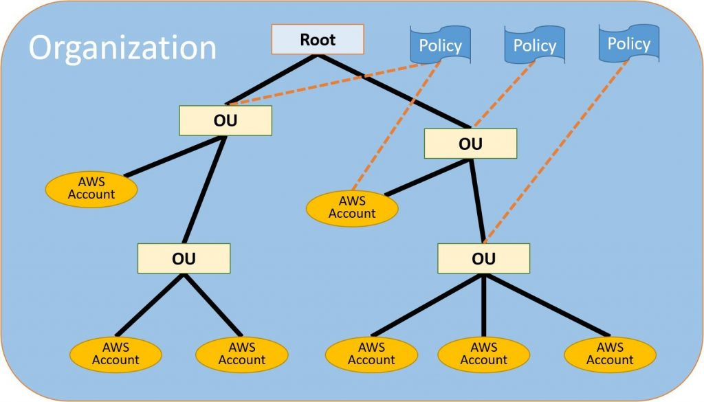
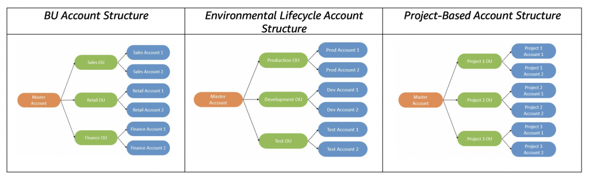

# 为电信公司定义AWS多账户策略

JesúsFederico，Francisco Uribe和GastónMedico | 上 2020年6月16日| 在 [工业](https://aws.amazon.com/blogs/industries/category/industries/)，[电信](https://aws.amazon.com/blogs/industries/category/industries/telecommunications/)

亚马逊网络服务（AWS）使通信服务提供商（CSP）能够在生产力，创新和降低成本方面实现巨大收益，与此同时，他们通过B2B业务来建立自己的SI能力。AWS提供了多种服务和功能，可灵活控制云计算资源和服务，以及用于管理从中部署这些资源的AWS账户的工具。

在此博客文章中，我们展示了帐户级别的考虑因素，最佳实践和高级战略指导，以帮助CSP使用[AWS Organizations](https://aws.amazon.com/organizations/)服务来构建和管理多个AWS帐户。

对于CSP，使用多个AWS帐户有很多好处：

- **管理或运营边界：** 可以实施**多个AWS账户来定义内部部门和组织之间的边界**。例如：B2B团队，网络团队，数字团队，等等。
- **开票实体：**某些CSP**在多个国家/地区分布有运营，可能需要为每个运营公司（OpCo）开立单独的发票**。
- **作为APN合作伙伴**的CSP **：** CSP可能拥有B2B组织，并且是[AWS合作伙伴网络](https://aws.amazon.com/partners/)（APN）的一部分，在那里他们提供托管在AWS云上或与AWS Cloud集成的硬件，连接服务或软件解决方案。在其他情况下，CSP可以帮助各种类型和规模的客户在AWS上设计，架构，构建，迁移和管理其工作负载和应用程序，从而加速其向云的迁移过程。
- **工作负载和安全边界：** 可以**使用AWS账户服务限制对特定业务部门、开发团队和项目施加限制，或者对其AWS资源设置管理控制，以根据工作负载、开发生命周期、业务单元或数据敏感性隔离账户**。
- **成本控制：** **在帐户级别生成详细的账单**。帐户具有更高的“粒度”，这是由计费标签启用的，计费标签启用了针对特定项目，区域或客户的跟踪与预算。

在开始使用最佳实践策略之前，让我们回顾一下[AWS Organizations](https://docs.aws.amazon.com/organizations/latest/userguide/orgs_getting-started_concepts.html)服务的一些概念，这些概念对于本文而言至关重要：

## 组织：

您创建的用于合并AWS[账户](https://docs.aws.amazon.com/organizations/latest/userguide/orgs_getting-started_concepts.html#account)的实体，以便您可以将其作为一个整体进行管理。您可以使用[AWS Organizations控制台](https://console.aws.amazon.com/organizations/) 集中查看和管理您组织内的所有账户。一个组织拥有一个主帐户以及零个或多个成员帐户。您可以采用类似树的分层结构来组织帐户， 顶部具有一个 [根](https://docs.aws.amazon.com/organizations/latest/userguide/orgs_getting-started_concepts.html#root)， 根下嵌套[有组织单位](https://docs.aws.amazon.com/organizations/latest/userguide/orgs_getting-started_concepts.html#organizationalunit)。每个帐户都可以直接位于根中，也可以置于层次结构中的一个OU中。组织具有的功能取决于您启用的 [功能集](https://docs.aws.amazon.com/organizations/latest/userguide/orgs_getting-started_concepts.html#feature-set)。

### 根：

**组织的所有帐户的父容器**。

如果将策略应用于根账户，则该策略将应用于[组织](https://docs.aws.amazon.com/organizations/latest/userguide/orgs_getting-started_concepts.html#organizationalunit)中的所有[组织单位（OU）](https://docs.aws.amazon.com/organizations/latest/userguide/orgs_getting-started_concepts.html#organizationalunit)和[帐户](https://docs.aws.amazon.com/organizations/latest/userguide/orgs_getting-started_concepts.html#account)。

目前，您只能拥有一个根账户。创建组织时，AWS Organizations会自动为您创建它。

### **组织单位（OU）：**

在根账户下的一种帐户容器。

- **一个OU也可以包含其他OU**，使您可以创建一个类似于倒置树的层次结构，其根账户在顶部，而OU的分支向下延伸，最终以树的叶子作为帐户。
- **将策略附加到层次结构中的一个节点时，它会向下流动并影响其下的所有分支**（OU）并离开（帐户）。
- 一个OU可以只有一个父级，当前每个帐户可以是一个OU的成员。

### **帐户：**

包含您的AWS资源的标准AWS账户。您可以将策略附加到帐户，以仅将控制应用于该帐户。

组织中有两种类型的帐户：指定为主帐户的单个帐户和成员帐户。

- **主帐户**：是创建组织的帐户。

  在组织的主帐户中，您可以执行以下操作：

  - 在组织中创建帐户
- 向组织邀请其他现有帐户
  - 从组织中删除帐户
  - 管理邀请
  - 将策略应用于组织中的实体（根，OU或帐户）

**主帐户具有*付款人帐户*的责任，并负责支付会员帐户产生的所有费用。您无法更改组织的主帐户。**

- **成员帐户**：属于组织的其余帐户。**一个帐户只能成为一个组织的成员帐户**。

### **着陆区：**

着陆区是一个基于安全性和合规性最佳实践的结构合理的多账户AWS环境。它为开始使用多帐户架构，IAM，治理，数据安全，网络设计和日志记录提供了基准。

### **综合帐单：**

AWS Organizations提供了 [合并账单](http://docs.aws.amazon.com/awsaccountbilling/latest/aboutv2/consolidated-billing.html)，使您可以在组织的主账户中设置一种**付款**方式，并在每个会员账户中收到 **一张**包含单个活动详细信息的**发票**。

### **AWS控制塔：**

[AWS Control Tower ](https://aws.amazon.com/controltower/)提供了最简单的方法来建立和管理新的，安全的，多账户的AWS环境，该环境基于通过AWS经验与数千家企业迁移到云中合作而建立的最佳实践。

如果您对以下任何一个问题回答“是”，则表明您可能想使用AWS Organizations构建AWS账户：

- *您是否想**使用账单或付款方式（例如信用卡或采购订单）来为多个AWS账户付款***？
- *您是否想**通过汇总AWS资源使用情况并将任何适用的折扣分散到多个账户中**来最大化您的潜在数量，*[*预留实例*](https://aws.amazon.com/aws-cost-management/aws-cost-optimization/reserved-instances/)*（RI）或“*[*储蓄计划”*](https://aws.amazon.com/savingsplans/)*折扣？*

## CSP和内部工作负载：

尽管对于一个特定的CSP应该有多少个单独的AWS组织没有一个万能的解决方案，但大多数公司都希望至少为其一个内部工作负载创建一个具有多个AWS账户的AWS组织。

根据每个CSP的结构和需求，有时仅针对内部工作负载实施一个AWS组织是不够的。

对以下任何一个问题回答“是”，就表明您应该为内部工作负载创建其他AWS组织：

- *企业是否需要**针对每个部门使用不同付款方式或单独发票**的强大财务和预算帐单？* 在这种情况下，为每个部门创建一个AWS组织。

- *公司是否在多个国家/地区开展业务，而**每个国家/地区的业务都需要特定的付款方式或分开的发票**？* 在这种情况下，为每个运营公司（OpCo）创建一个AWS组织**。**

**对于内部工作负载，组织单位（OU）和帐户结构的设计可以遵循基于CSP的组织、运营或成本结构的策略**。例如：

 

## **CSP和B2B工作负载：**

CSP可能拥有一个“业务解决方案”或B2B组织，通过它们，它们可以提供托管在AWS云上或与AWS Cloud集成的硬件，连接服务或软件解决方案。通常，建议CSP需要针对以下每种情况创建一个单独的AWS组织：

- -  CSP作为APN[咨询合作伙伴](https://aws.amazon.com/partners/consulting/)：如果CSP是APN的一部分，并且是AWS[解决方案提供商计划](https://aws.amazon.com/partners/solution-provider/)（SPP）的一部分，该[项目被](https://aws.amazon.com/partners/solution-provider/)授权管理，服务，支持账单并向其计费，并为最终客户转售AWS服务，则有必要为此用途创建一个新的AWS组织，并为每个最终客户创建一个AWS账户。
  - 提供B2B多租户打包解决方案的CSP：作为管理边界，建议创建一个AWS组织来管理每个多租户打包解决方案。（例如，多租户备份解决方案，多租户统一通信解决方案等）。
  - CSP为最终客户提供自己的着陆区或需要专用的主付款者账户：根据最终客户的规模，复杂性和需求以及所提供解决方案的要求，CSP可能需要创建一个AWS组织来为那些特定的最终客户。
  - 为AWS提供不同支持级别和模型的CSP：如果CSP提供由合作伙伴领导的支持，转售企业支持或拥有具有不同支持级别（例如，业务对企业）的AWS账户，则有必要为每种支持创建不同的AWS组织水平。

## 企业支持注意事项：

AWS解决方案提供商计划（SPP）使合格的合作伙伴可以转售AWS服务，包括AWS Support。提供[合作伙伴主导支持的](https://aws.amazon.com/premiumsupport/partner-led-support/)认可解决方案提供商由AWS支持组织支持。AWS解决方案提供商和AWS Support共同努力，以确保您可以从解决方案提供商的知识和服务以及AWS Support代理的专业知识中受益。

AWS提供的支持与合作伙伴主导的支持之间有一些区别。例如，在合作伙伴主导的支持下，所有客户支持案例均直接通过解决方案提供商打开。解决方案提供商将直接与最终用户进行故障排除和解决支持案例，并根据需要上报给AWS Support。

如果CSP提供合作伙伴主导的支持或转售企业支持，则有必要创建单独的AWS组织。

## AMS注意事项：

随着企业客户逐渐大规模采用云，一些人发现他们的员工需要帮助和时间来获得AWS技能和经验。[AWS托管服务（AMS）](https://aws.amazon.com/managed-services/)代表您运行AWS，提供安全且合规的AWS Landing Zone，可靠的企业运营模型，持续的成本优化，日常基础架构管理，安全控制和合规性控制。

如果CSP是授权的AWS Managed Services合作伙伴，则他们将需要为此创建单独的AWS组织**。**

## 结论：

对于特定CSP应该拥有多少个单独的AWS组织或AWS账户，没有统一的方法。在考虑多个变量以便为您的特定案例和需求定义最合适的AWS Multi-Account策略时，前面所述的不同案例应该会有所帮助。

重要的是要考虑到，随着AWS组织内AWS帐户数量的增长，CSP需要构建其治理结构以增长和扩展。为了帮助您解决此问题，AWS开发了[AWS规模治理](https://docs.aws.amazon.com/whitepapers/latest/aws-governance-at-scale/introduction.html)白皮书，以帮助识别和实例化最佳实践。

要获取有关您的特定情况的指导，请联系您的AWS账户团队。如果您没有AWS客户团队，请联系[Sales](https://aws.amazon.com/contact-us/)。

TAGS： [帐户结构](https://aws.amazon.com/blogs/industries/tag/account-structure/)，[塔台](https://aws.amazon.com/blogs/industries/tag/control-tower/)，[CSP](https://aws.amazon.com/blogs/industries/tag/csps/)，[着陆区](https://aws.amazon.com/blogs/industries/tag/landing-zone/)，[多帐户](https://aws.amazon.com/blogs/industries/tag/multi-account/)，[OU](https://aws.amazon.com/blogs/industries/tag/ou/)，[电信](https://aws.amazon.com/blogs/industries/tag/telecom/)

原文：Defining an AWS Multi-Account Strategy for telecommunications companies

https://aws.amazon.com/cn/blogs/industries/defining-an-aws-multi-account-strategy-for-telecommunications-companies/