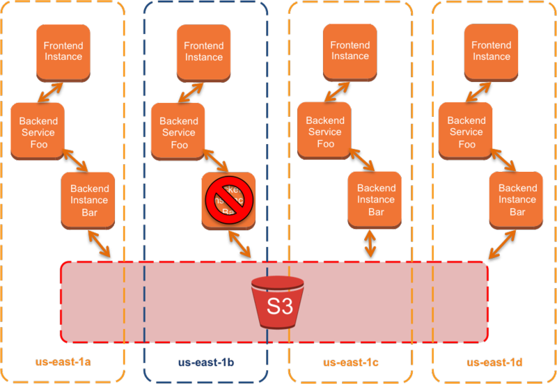

# AWS和分区化 （AWS and Compartmentalization）

由Colm MacCarthaigh | 上 2014年3月26日| 在 [Amazon Route 53中](https://aws.amazon.com/blogs/architecture/category/networking-content-delivery/amazon-route-53/)，[建筑](https://aws.amazon.com/blogs/architecture/category/architecture/)| [固定链接](https://aws.amazon.com/blogs/architecture/aws-and-compartmentalization/)| [ 分享](https://aws.amazon.com/cn/blogs/architecture/aws-and-compartmentalization/#)

实际上，每位有经验的驾驶员都会轮胎漏气。这真是一件令人讨厌的事，您开车过去，倒空后备箱以取出备用轮胎，顶起汽车并更换爆胎，然后再开车去附近的维修店。对于没问题的汽车，我们可以容忍偶尔的滋扰，而作为驾驶员，我们离安全的地方不远，可以过马路或友好的维修店。

使用可用性术语，备用轮胎是一种备用轮胎，一种组件或系统，在需要时会闲置等待部署。这些在计算机系统中也很常见。例如，许多数据库依赖于备用故障转移，其中一些甚至依靠人为干预，人工运行脚本，因为他们可能会car-jack（尽管我们建议改为使用Amazon Relational Database，该数据库包括自动故障转移） ）。

但是，当赌注更高时，事情做起来会有所不同。以现代喷气式客机中的系统为例，尽管最近发生了悲剧性事件，但这些系统的安全记录仍然很出色。航班不能转弯，如果出现问题，客机可能必须在跑道范围内飞行数小时。**对于客机，关键系统通常使用主动冗余**。例如，一台双引擎喷气式飞机只能在一个工作的发动机上飞行-因此，如果其中一台发生故障，另一台仍然可以轻松地将喷气飞机保持在空中。

这种模型在大型Web系统中也很常见。例如，有许多处理amazon.com的EC2实例，**当一个实例偶尔发生故障时，会在其他服务器之间分散容量缓冲**，以确保客户甚至不会注意到。

喷气发动机并不能简单地自行失效。数十个组件中的任何一个（数字发动机控制器，燃油管路和泵，齿轮和轴等）都可能导致发动机停止工作。对于这些组件中的每个组件，飞机设计人员都可以尝试在组件级别上包括一些冗余（有些还包括航空电子设备），但由于存在多个冗余，因此在故障隔离或隔离方面更容易重新设计分区：**只要每个引擎都依赖于每个组件的单独实例，那么任何组件都无法同时使用（take out）两个引擎**。燃油管路可能会断裂，但只能使一台发动机停止运转，并且该飞机已经设计成可以在不使用一台发动机的情况下工作。

**这种分隔对于复杂的计算机系统特别有用**。大型网站或Web服务可能依赖于数十甚至数百个子服务。本身就可以包含强大的主动冗余。**通过调整子服务的实例，使相互依赖性永远不会跨越隔离分区，我们可以确保问题可以包含在开始的隔离分区中**。这还意味着我们**可以尝试通过隔离整个隔离分区来解决问题，而无需在隔离分区内找到问题的根源**。

# AWS和分区化

Amazon Web Services包含一些功能和产品，可实现有效的分区。首先，许多Amazon Web Services（例如Amazon S3和Amazon RDS）本身在内部是隔离的，并利用主动冗余设计，以便在发生故障时将它们隐藏起来。

我们还提供各种规模的Web服务和资源，以及自动扩展，CloudFormation模板和Opsworks配方等形式的自动化功能，可轻松管理更多实例。

在运行少量大型实例和大量小型实例之间存在细微但重要的区别。四个m3.xlarge实例的成本高达两个m3.2xlarge实例的成本，并提供相同数量的CPU和存储；但是对于高可用性配置，使用四个实例仅需要33％的故障转移容量缓冲区，任何主机级别的问题都可能影响您四分之一的负载，而使用两个实例则意味着100％的缓冲区，任何问题都可能影响一半的负载。

第三，**Amazon Web Services具有预制的隔离分区：每个区域最多四个可用区（AZ）**。这些可用性区域被深度划分为**数据中心，网络和电源级别**。

假设我们创建一个利用四个可用性区域的网站或Web服务。这意味着我们每个区域需要一个25％的故障转移容量缓冲区（与标准的两个数据中心模型中的100％的故障转移容量缓冲区相当）。我们的服务包括一个前端，两个相关的后端服务（“ Foo”和“ Bar”）和一个数据存储（在此示例中，我们将使用S3）。

**通过限制任何子服务调用以使其停留在可用区域内，我们可以更轻松地隔离故障**。如果us-east-1b中的后端服务“ Bar”失败（例如软件崩溃），则将影响我们总容量的1/4。

最初，这似乎比我们从Bar服务的所有实例的所有区域分配给Bar服务的呼叫要好得多。毕竟，故障率也将是五分之一。但是区别是深远的。

首先，**经验表明，小问题通常会在复杂的系统中放大**。例如，如果“ Foo”服务需要更长的时间来处理对“ Bar”服务的失败呼叫，则“ Bar”服务的最初问题开始影响“ Foo”的行为，进而影响前端。

其次，**通过具有一种简单的通用机制来使故障脱离受感染的可用区域，可以可靠、简单且快速地解决问题**，就像飞机可以设计成可以在一个发动机上飞行并且可以处理许多类型的故障一样，如果发动机出现故障，并且仅执行简短的检查清单就无法恢复健康，只需将其关闭并降落在下一个机场即可。

# Route 53 Infima

我们建议的用于处理此类故障的机制是[Amazon Route 53 DNS故障转移](http://docs.aws.amazon.com/Route53/latest/DeveloperGuide/dns-failover.html)。**由于DNS是将服务/网站名称转换为要连接的特定前端IP地址列表的服务，因此它位于每个请求的开始，并且是消除问题的理想层**。

**使用Route 53运行状况检查和DNS故障转移，可以对每个前端进行持续的运行状况检查，并在出现问题时自动将其从DNS中删除**。**Route 53运行状况检查URL可以完全自定义，并且可以指向用于检查可用性区域中每个依赖项的脚本**（“ Foo是否正常工作，Bar是否正常工作，S3是否可访问，等等……”）。

这将我们带到[Route 53 Infima](https://github.com/awslabs/route53-infima)。Infima是一个库，旨在系统地对分区进行建模，并帮助表示DNS中的此类配置。**使用Infima，可以将端点分配给特定的隔离分区，例如可用性区域**。对于高级配置，**还可以添加其他分区维度，例如，您可能希望在每个可用性区域中运行同一服务的两种不同软件实现（可能用于蓝/绿部署，以实现应用程序级冗余）**。

了解过Infima库后，可在隔室内建立端点布局，然后可以在软件中模拟故障并确定容量上的任何差距。但是Infima的真正功能在于在DNS中表达这些配置。

我们的示例服务在4个可用区中具有4个端点。在DNS中表示此选项的一种方法是每四个端点返回一次。**每个响应（answer）还可能取决于运行状况检查，当运行状况检查失败时，可以将其从DNS中删除**。Infima支持此配置。但是，有一个更好的选择。DNS（自然是Route 53）允许在单个响应中表示多个端点，例如：

当客户端（例如浏览器或Web服务客户端）收到这些响应时，它们通常会尝试多个端点，直到找到成功连接的端点为止。因此，通过包括所有端点，我们可以获得一定的容错能力。但是，如我们之前所见，**当端点发生故障时，问题可能会蔓延，客户端可能会遇到重试计时器和某些延迟，因此仍然需要及时从DNS答复中删除IP**。

**Infima可以使用隔离分区，端点及其运行状况检查的列表来构建我们所谓的RubberTree，RubberTree是DNS响应（answer）的预先计算的决策树，具有预先准备就绪并等待潜在故障的响应：单个节点发生故障，整个隔离分区失败，两者的结合等等**。然后**将该决策树存储为Route 53配置，并可以自动处理任何故障**。因此，如果192.0.2.3端点发生故障，则：

将被退回。通过预备好这些决策树并使其始终处于等待状态，Route 53能够对端点故障做出快速反应，这意味着通过区域化我们还准备处理为该端点提供服务的任何子服务的故障。

到目前为止，对于某些类型的错误，我们已经看到了最有效的区域化方法。主机级问题，偶有崩溃，应用程序锁定。但是，**如果问题是由于前端级别的请求本身引起的，例如拒绝服务攻击或触发灾难性错误的“毒丸”请求，则它可能会迅速感染您的所有隔离分区**。Infima还包括一些简洁的功能来帮助隔离甚至这些类型的故障，这将是我们下一篇文章的主题。

# 奖励内容：清除缓存

我写道，即使**在一个响应（answer）中有多个端点，及时从DNS中删除失败的端点非常重要，在这方面要解决的一个问题是应用程序级DNS缓存损坏**。某些平台（包括许多Java版本）不考虑DNS缓存的生存期（DNS生存时间或TTL值），一旦DNS响应被解析，它将被无限期地使用。

**缓解此问题的一种方法是使用缓存“清除”**。Route 53支持通配符记录（以及通配符ALIAS，CNAME等）。除了使用诸如“ api.example.com”之类的服务名称之外，还可以使用通配符名称，例如“ * .api.example.com”，该通配符名称将匹配对以“ .api”结尾的任何名称的请求。 example.com”。

然后可以以解析部分随机名称的方式编写应用程序，例如“ sdsHdsk3.api.example.com”。**由于该名称以api.example.com结尾，因此仍然会获得正确的答案，但是由于每次都是唯一的随机名称，因此它将破坏（或“破坏”）任何损坏的平台或OS DNS缓存**。

– ColmMacCárthaigh

TAGS： [故障隔离](https://aws.amazon.com/blogs/architecture/tag/fault-isolation/)

原文：AWS and Compartmentalization

https://aws.amazon.com/cn/blogs/architecture/aws-and-compartmentalization/