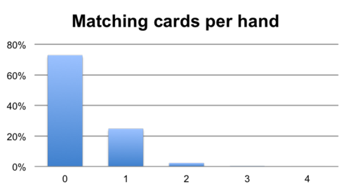
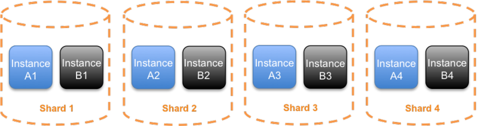
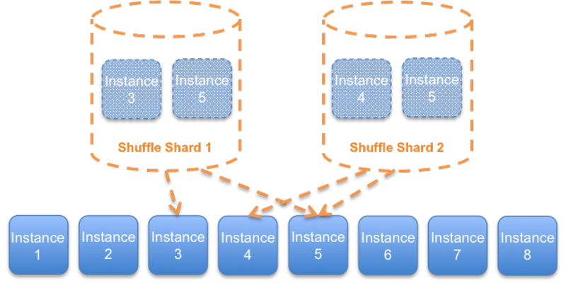
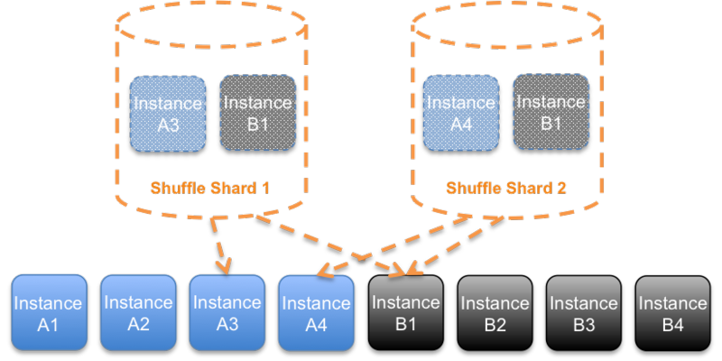

# 随机分片：大规模而神奇的故障隔离

由Colm MacCarthaigh | 上 2014年4月14日| 在 [Amazon Route 53中](https://aws.amazon.com/blogs/architecture/category/networking-content-delivery/amazon-route-53/)

一个标准的扑克牌有52种不同的扑克牌和2个小丑。如果我们彻底洗牌，并发出四张牌，则有超过30万张不同的牌。说同一件事的另一种方式是，如果我们放回纸牌，重新洗牌然后再次发牌，则我们再次发同一手牌的概率要小于30万分之一。这是极不可能的。

同样不可能的是，其中一张牌在两只手之间匹配的机会也会少于1/4。为了使图片更完整，两张牌匹配的机会要少于1/40，而三张牌相同的机会则要少于1/1000。

在我们的上一篇文章中，我承诺将详细介绍如何**使用Route 53 Infima来隔离与请求相关的故障，例如用户或客户特定的问题**。**Route 53 Infima的Shuffle Sharding采用这种迅速减少匹配（matches）数量的模式，并将其与传统的水平伸缩相结合以产生一种故障隔离**（这种模式是许多纸牌游戏，彩票甚至宾果游戏的基础），这种隔离似乎几乎神奇。

# 传统水平缩放

**除最小的服务外，所有服务通常都在一个以上的实例上运行**（尽管有一些令人印象深刻的例外）。**使用多个实例意味着我们可以拥有主动冗余：当一个实例遇到问题时，其他实例可以接管。通常，流量和请求分布在所有正常实例上**。

**尽管此模式对于平衡流量和处理偶尔的实例级故障非常有用，但如果请求本身存在某种有害的情况，那就太可怕了：每个实例都会受到影响**。例如，如果该服务为许多客户提供服务，那么一个忙碌的客户可能会淹没其他所有人。**基于每个客户的请求限制可能会有所帮助，但限制机制本身也可能不堪重负**。

更糟糕的是，**如果问题是某种“毒药请求”，那么节流将无济于事**。**如果某个特定的请求碰巧触发了导致系统故障转移的错误，则调用者可以通过实例间反复尝试相同的请求，直到实例全部崩溃来触发级联故障**。

# 分片隔板

我们可以**对传统的水平伸缩进行故障隔离的一种改进是使用分片**。**分片是传统上用于数据存储和索引系统的技术**。我们可以将实例划分为分片，而不是将来自所有客户的流量分散到每个实例中。例如，如果我们有八个服务实例，则可以创建四个分片，每个分片两个实例（两个分片用于每个分片内的某些冗余）。

接下来，我们将面临如何分片的决定。**一种常见的方式是通过客户ID将客户分配给特定的分片，但是其他分片选择也是可行的，例如通过操作类型或资源标识符**。您甚至可以选择执行多维分片，并让客户资源对选择一个分片或客户资源操作类型。

对于给定服务而言，最有意义的选择取决于其内在性和特定的风险组合，但是**通常可以找到ID或操作类型的某种组合**，如果可以将其隔离开，那将产生很大的不同。

**使用这种分片后，如果请求导致问题，那么我们将获得与以前相同的隔板效果，将问题隔离在一个分片中**。因此，在上面的示例中，使用四个分片时，大约有四分之一的客户（或选择了其他维度的客户）可能会受到一个客户触发的问题的影响。这远比所有受影响的客户都好。

**如果为客户（或对象）指定了要使用的特定DNS名称（就像为客户提供了具有许多AWS服务的唯一DNS名称一样），则可以使用DNS来使每个客户在各个分片之间保持清晰的分隔**。

# 随机分片

通过分片，我们能够与我们拥有的实例数量成正比地减少客户影响。即使我们有100个分片，如果发生问题，仍有1％的客户仍然会受到影响。对此的一个明智的解决方案是构建监视系统，该系统可以检测到这些问题，并在检测到问题后将问题请求重新分到它们自己的完全隔离的分片中。这很好，但这是一种被动的措施，通常只能减轻影响，而不是首先避免影响。

使用随机分片，我们可以做得更好。**随机分片的基本思想是类似从一副纸牌中发牌一样生成分片**。以八个实例为例，以前，我们将其分为两个实例的四个分片。使用随机分片时，分片包含两个随机实例，并且分片就像我们的手牌一样，可能会有些重叠。

通过从八个实例中选择两个实例，可以有56个潜在的随机分片，远远超过我们之前拥有的四个简单分片。

乍一看，这些Shuffle分片似乎不太适合隔离故障。在上面的示例图中，两个随机分片共享实例5，因此影响该实例的问题可能会影响两个分片。**解决此问题的关键是使客户端能够容错。通过在客户端中使用简单的重试逻辑，使它可以尝试Shuffle分片中的每个端点，直到一个成功为止，我们得到了惊人的隔板效果**。

在客户端尝试分片中的每个实例的情况下，导致对Shuffle Shard 1造成问题的客户可能会同时影响实例3和实例5，因此会受到影响，但是使用Shuffle Shard 2的客户应仅经历微不足道的情况（如果有的话） ）如果客户重试经过了仔细的测试和实施以正确处理这种部分降级，则会产生影响。因此，实际影响被限制在整个混洗分片的1/56。

1/56的影响是对1/4的重大改进，但我们仍然可以做得更好。以前，**通过简单的分片，我们需要在每个分片中放置两个实例以具有一定的冗余性**。像传统的N + 1水平伸缩一样，通过随机分片，我们可以使用更多实例。**我们可以分派尽可能多的实例，只要我们愿意重试**。**通过3次重试（一个通用的重试值），每个洗牌分片总共可以使用四个实例**。

每个洗牌分片有四个实例，我们可以将影响减少到总客户群的1/1680，而且我们使“嘈杂的邻居”问题更易于管理。

# Infima和Shuffle分片

Route Infima库包括两种Shuffle分片。

第一种是简单的**无状态随机分片**。与bloom过滤器一样，**无状态随机分片使用哈希来获取客户，对象或其他标识符，并将其转变为随机分片模式**。就像我们从一副纸牌中交易时一样，**这种技术导致客户之间出现重叠的可能性**。但是，由于无状态，这种混洗分片可以轻松使用，甚至可以直接在调用客户端中使用。

第二种随机分片是**有状态搜索随机分片**。**随机排序分片是使用随机分配生成的**，就像从一副纸牌中取出的手一样，**但是内置支持针对每个先前分配的分片检查每个新生成的分片，以确保重叠**。例如，我们可以选择为20个端点中的每个随机分片分配4个，但不要求两个随机分片共享两个以上的特定端点。

Infima中的两种随机分片都可以识别分区。例如，我们**可以确保混洗分片也可以利用每个可用性区域**。因此，我们的实例可能位于2个可用区中，每个可用区中有4个。**Infima可以确保从每个区域中选择2个端点，而不是简单地随机选择2个端点**（这可以从一个可用区域中选择两个端点）。

最后，Infima还使Shuffle分片与RubberTrees一起使用变得容易，因此可以使用Route 53在DNS中轻松表示端点。例如，可以为每个客户提供自己的DNS名称，该名称映射到要处理的Shuffle分片由RubberTree提供。

# 后记

工作中的两个通用原则是，**使用许多较小的东西通常会更好，因为这会降低容量缓冲区的成本并使所有争用的影响变小，并且允许分片在其成员资格中部分重叠可能是有益的作为回报，系统可以支持的分片数量呈指数增长**。

这些原则意味着Shuffle Sharding是一种通用技术，您**还可以选择对多种资源进行Shuffle Shard，包括队列，速率限制器，锁和其他竞争性资源之类的纯内存数据结构**。

碰巧的是，Amazon Route 53，CloudFront和其他AWS服务使用分区，按客户的随机分片等功能来提供故障隔离，并且我们将在以后的博客文章中分享有关其中某些功能的更多详细信息。

作者更新：此博客文章的早期版本使用错误的数字表示52张牌中的4张牌手数（我根据排列写了700万张，而不是根据组合写了300,000张）。

TAGS： [故障隔离](https://aws.amazon.com/blogs/architecture/tag/fault-isolation/)

原文：Shuffle Sharding Massive and Magical Fault Isolation

https://aws.amazon.com/cn/blogs/architecture/shuffle-sharding-massive-and-magical-fault-isolation/