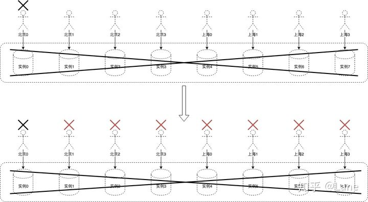
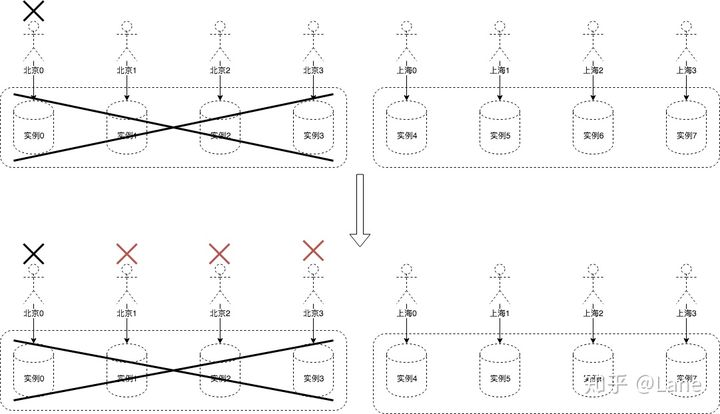
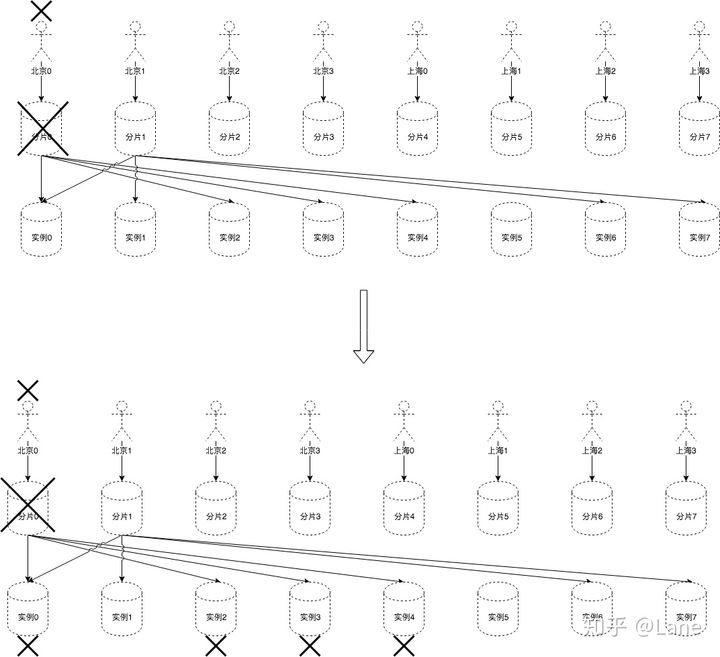

# AWS的Shuffle Sharding

[Lane](https://www.zhihu.com/people/lane-75)

原文地址：[https://aws.amazon.com/cn/blogs/architecture/shuffle-sharding-massive-and-magical-fault-isolation/](https://link.zhihu.com/?target=https%3A//aws.amazon.com/cn/blogs/architecture/shuffle-sharding-massive-and-magical-fault-isolation/)

## 1.名词解释

Shard：分片，实例的容器
Instance：实例

## 2.传统水平缩放（Traditional Horizontal Scaling）

优势：结构简单，无隔离设计
劣势：遭遇“有毒”请求，影响所有用户，100%

## 2.分片挡板（Sharding and Bulkheads）

优势：结构简单，存在简单的隔离设计
劣势：遭遇“有毒”请求，影响分片的所有用户，50%

## 3.随机分片（Shuffle Sharding）

优势：结构简单，存在简单的隔离设计

劣势：

- 遭遇“有毒”请求，影响分片内所有的用户，12.5%；

- 因为是随机分片，所以其他用户存在被影响的可能，
- 发生于其所使用的分片随机选取的4个实例与分片0随机选取的4个实例完全一致，即1/8 * 1/7 * 1/6 * 1/5 = 1/1680，
- 故影响25%用户的可能性为1/1680；

公式：

C：1个分片承接的用户数，1/C：1个分片承接的用户占比；
S：分片数；
I：实例数；
N：每个分片关联的实例数；

影响用户占比：可能性
1/C ：100%
2/C ： ![[公式]](https://www.zhihu.com/equation?tex=%5Cfrac%7B1%7D%7BA_I%5EN%7D)

成文于：2019-07-24

原文：https://zhuanlan.zhihu.com/p/77637361