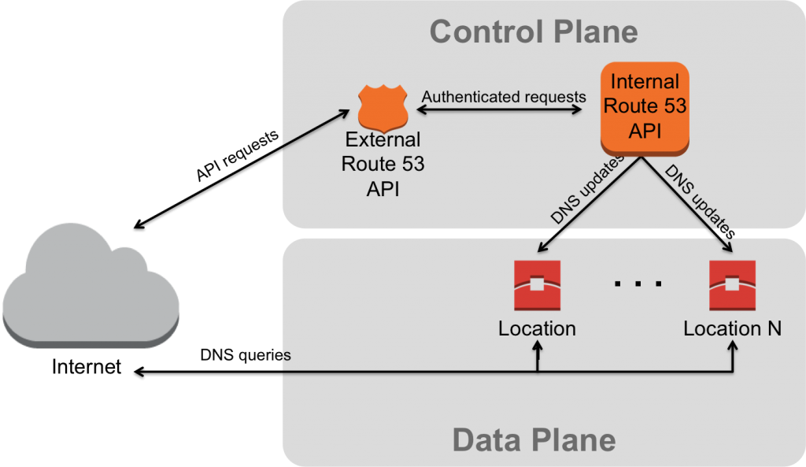
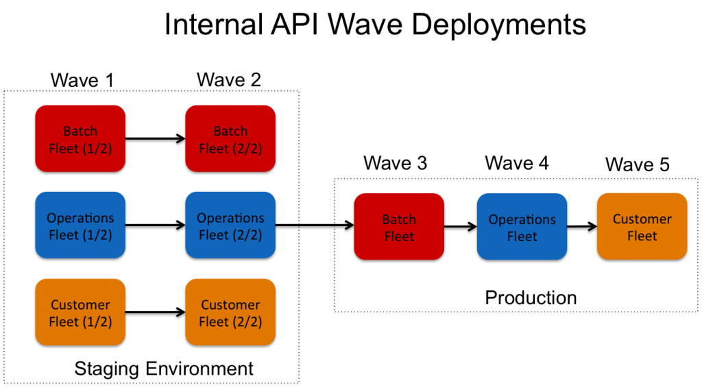
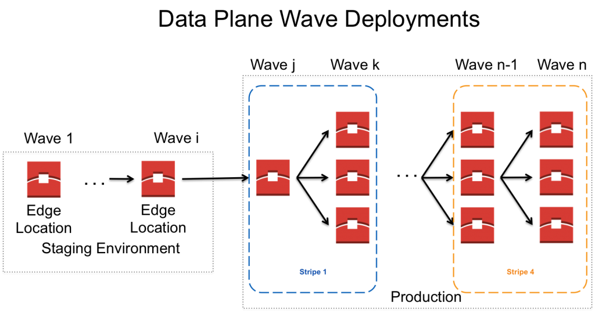

# 组织软件部署以匹配故障条件

尼克·特雷邦（Nick Trebon）| 上 2014年5月5日| 在 [Amazon Route 53中](https://aws.amazon.com/blogs/architecture/category/networking-content-delivery/amazon-route-53/)

将新软件部署到生产中通常会带来一定的风险，并且偶尔会发生失败的部署（例如，软件错误，配置错误等）。**作为服务所有者，目标是尝试减少这些事件的数量，并在事件发生时限制对客户的影响**。减少潜在影响的一种方法是根据服务的故障情况来制定部署策略。因此，**当部署失败时，服务所有者可以对爆炸半径以及影响范围拥有更多控制权**。这些策略**需要了解系统的各个组件如何交互，这些组件如何发生故障以及这些故障如何影响您的客户**。

首先，我将简要描述一些部署过程和Route 53架构，以便为我们选择的部署策略提供一些背景信息。希望这些示例将揭示可以有益于您自己的服务可用性的策略。**与许多服务一样，Route 53由多个环境或阶段组成：一个用于开发阶段、一个用于暂存生产变更和一个用于生产阶段**。试图减少生产中失败的部署数量的自然张力是增加刚性和进程，从而减慢新代码的发布。**在Route 53，我们不执行严格的发布或部署时间表；各个开发人员负责验证他们在预发环境中的更改并将其变更投入生产**。通常，我们的部署以流水线方式进行。管道的每一步都被称为“波浪”，由我们机队的一部分组成。**流水线是一个很好的抽象，因为每个波浪都可以视为独立且独立的步骤**。在每波流水线之后，可以验证更改-这可以包括自动，计划和手动测试以及服务指标的验证。此外，**我们通常将间隔较早的生产部署间隔至少24小时，以使这些变更可以“bake”**。**让软件烘烤是指缓慢地推出软件更改，以允许我们在将部署推向下一个浪潮之前，通过生产量验证这些更改并验证服务指标**。仅将新代码部署到您的一部分机队的明显优势在于，它将失败的部署的影响降低到仅包含新代码的一部分机队。我们的部署基础架构的另一个好处是，它为我们提供了一种机制，可以在检测到任何问题时将部署快速“回滚”到以前的软件版本，这在许多情况下使我们能够快速缓解失败的部署。

根据我们的经验，我们进一步组织了部署，以尝试匹配故障条件，以进一步减少影响。首先，我们的部署策略是针对我们部署目标的系统部分量身定制的。我们通常提到**Route 53的两个主要组成部分：控制平面和数据平面**（如下图所示）。

控制平面主要由我们的API和DNS更改传播系统组成。从本质上讲，这是我们系统的一部分，它接受客户创建或删除DNS记录的请求，然后将该更新传输到分布在世界各地的所有DNS服务器。

数据平面由我们的DNS服务器组成，负责代表客户回答DNS查询。这些服务器目前位于全球50多个位置。

这两个组件都有自己的一组失败条件，并且失败的部署将如何影响客户。此外，一个组件的故障可能不会影响另一个组件。例如，客户无法创建新的托管区域或记录的API中断不会对我们的数据平面产生任何影响，因为该中断继续回答中断之前创建的所有记录的查询。给定它们独特的故障条件集，控制平面和数据平面具有自己的部署策略，下面将分别讨论它们。

# 控制平面部署

控制平面的大部分实际上由两个API组成。

- 第一个是我们可以从Internet访问的外部API，它是客户创建，删除和查看其DNS记录的切入点。在将客户请求转发到我们的内部API之前，此外部API会对其进行身份验证和授权检查。
- 第二个内部API支持的操作集比外部API需要的操作多得多。它还包括监视DNS更改并将其传播到我们的DNS服务器所需的操作，以及操作和监视服务所需的其他操作。外部API部署失败通常会影响客户查看或修改其DNS记录的能力。

外部API的部署相当简单。**为了提高可用性，我们在多个可用性区域中托管外部API**。**每个部署浪潮均由单个可用区内的主机组成，并且该可用区内的每个主机都分别部署**。**如果任何单个主机部署失败，则自动停止到整个可用性区域的部署**。

负载均衡器可以在特定的可用区域中快速捕获并缓解某些主机故障，该负载均衡器负责对主机进行运行状况检查。

**未通过这些负载均衡器运行状况检查的主机将由负载均衡器自动从服务中删除**。从而，如果仅将单个主机部署失败，则会导致将其自动从服务中删除，并且无需任何操作员干预即可停止部署。**对于可能不会导致负载均衡器运行状况检查失败的其他类型的失败部署，将波动限制在单个可用性区域中，则使我们能够在检测到故障后轻松地从该可用性区域翻转**。可以将类似的方法应用于在多个区域和可用区中使用Route 53 plus ELB的服务。**ELB自动运行状况检查其后端实例，并从服务中删除不正常的实例**。通过创建标记为评估目标运行状况的Route 53别名记录（请参阅[ELB文档中](http://docs.aws.amazon.com/elasticloadbalancing/latest/classic/using-domain-names-with-elb.html#configure-dns-failover)有关如何进行设置的信息），如果ELB后面的所有实例都不正常，则Route 53将无法使用该别名，并尝试查找要使用的备用健康记录。此配置将为不正常的区域或可用性区域在DNS级别启用自动故障转移。要启用手动故障转移，只需将ELB的别名资源记录集转换为加权别名，或将其与您控制其健康的健康检查相关联。要启动故障转移，只需将权重设置为0或使运行状况检查失败。加权别名还使您能够缓慢增加到该ELB的流量，这对于验证您自己对后端实例的软件部署很有用。

对于我们的内部API，部署策略更加复杂（如下图所示）。在这里，我们的机队按其处理的交通类型划分。我们将流量分为三种类型：

（1）用于监视服务的低优先级，长期运行的操作（批处理车队）；

（2）用于操作和监视服务的所有其他操作（操作队）；

（3）所有客户运营（客户车队）。

然后，按生产流量对整个服务的重要性来组织生产内部API的部署。例如，批处理车队首先部署，因为它们的操作对于服务的运行并不关键，我们可以忍受该车队的长时间停机。同样，我们将运营机队的优先级设置为低于客户流量，因为我们宁愿在部署到运营机队失败后继续接受并处理客户流量。

对于内部API，我们还组织了与生产阶段不同的阶段阶段。在登台浪潮中，所有三个舰队分为两个浪潮。故意这样做是为了使我们能够验证代码更改是否在同时运行多个软件版本的拆分世界中起作用。我们发现这对于捕获软件版本之间的不兼容很有用。**由于我们永远不会在同一时间将软件部署到100％的机队中，因此我们的软件更新必须设计为与以前的版本兼容**。

最后，与外部API一样，所有wave部署一次只能由一台主机进行。对于此API，我们还将深度应用程序运行状况检查作为部署的一部分。与外部API的负载平衡器运行状况检查类似，如果此运行状况检查失败，则会立即停止整个部署。

# 数据平面部署

如前所述，我们的**数据平面由Route 53的DNS服务器组成，这些DNS服务器分布在世界各地的50多个不同位置（我们将每个位置称为“边缘位置”）**。

我们的部署策略的一个重要考虑因素是我们如何跨位置划分任意播IP空间。总而言之，**每个托管区域都被分配了四个委托名称服务器，每个服务器都属于一个“条带”（即，我们的任意播范围的四分之一）**。一般而言，每个边缘位置仅宣布单个条纹，因此每个条纹由我们全球大约1/4的边缘位置宣布。因此，当解析程序对四个委托名称服务器中的每一个发出查询时，这些查询将通过BGP定向到每个条带中最近的（在网络意义上）边缘位置。尽管我们的API的可用性和正确性很重要，但**数据平面的可用性和正确性更为重要**。在这种情况下，中断将直接导致我们的客户中断。此外，由于中间解析器和最终客户都缓存了该答案，因此甚至代表一个客户提供单个错误答案的影响也被放大。因此，我们对数据平面的部署进行了更加仔细的组织，以防止部署失败并减少潜在影响。

**部署和最小化影响的最安全方法是一次部署到单个边缘位置**。但是，在开发人员监督下的手动部署中，这种方法无法随我们将新软件部署到50多个位置（每年增加的位置）的频率而扩展。因此，我们的大部分生产部署浪潮都由多个地点组成；**一个例外是我们的第一波只包含一个位置**。此外，**此位置是特别选择的，因为它运行着我们最旧的硬件，它可以为我们快速通知任何意外的性能下降**。

重要的是要注意，尽管解析器的缓存行为可能会导致问题（如果我们提供的答案不正确），但它们可以很好地处理其他类型的失败。当递归解析器收到对未缓存记录的查询时，它通常会并行地向四个委托名称服务器中的至少三个发出查询，并且它将使用收到的第一个响应。因此，如果我们的位置之一是黑洞客户查询（即，不回复DNS查询），则解析程序应从其他委托名称服务器之一接收响应。在这种情况下，唯一的影响是对那些没有应答的边缘位置是最快响应者的解析器。现在，该解析器将有效地等待第二快的条带的响应。为了利用这种弹性，我们对其他浪潮进行了组织，使它们包括地理上各不相同的边缘位置，目的是对于任何单个分解器，都会有当前部署浪潮中未包括的附近位置。此外，为了确保最多影响所有客户的单个名称服务器，实际上是按条纹组织了wave。

最后，每个条带分布在多个波浪中，因此故障对于我们的部分客户仅影响一台名称服务器。

下面描述了此策略的一个示例。一些注意事项：我们的预发环境由比生产少得多的边缘位置组成，因此单位置波动是可能的。其次，每个条纹用颜色表示；在此示例中，我们看到部署跨蓝色和橙色条纹分布。您也可以考虑围绕故障情况组织部署策略。例如，如果您的生产系统和仓库系统都使用了数据库模式，则首先将更改部署到仓库系统以确保您没有破坏任何兼容性。

# 结论

我们团队在过去3年多的时间里使用Route 53的经验突显了减少部署失败的影响的重要性。多年来，我们已经能够识别一些常见的故障情况并以这种方式组织我们的软件部署，以便我们增加缓解的难度，同时减少对客户的潜在影响。

–尼克·特雷邦（Nick Trebon）

TAGS： [部署](https://aws.amazon.com/blogs/architecture/tag/deployments/)，[故障隔离](https://aws.amazon.com/blogs/architecture/tag/fault-isolation/)

原文：Organizing Software Deployments to Match Failure Conditions

https://aws.amazon.com/cn/blogs/architecture/organizing-software-deployments-to-match-failure-conditions/