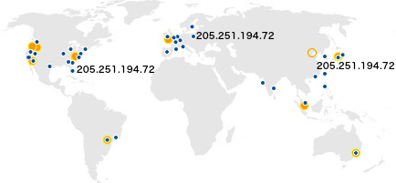
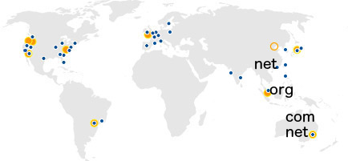

# 全局故障隔离的案例研究

Zen-Ming Zen | 上 2014年5月21日| 在 [Amazon Route 53](https://aws.amazon.com/blogs/architecture/category/networking-content-delivery/amazon-route-53/)

在先前的博客文章中，我们讨论了[使用随机分片来实现神奇的故障隔离](https://aws.amazon.com/blogs/architecture/shuffle-sharding-massive-and-magical-fault-isolation)。今天，我们将研究Route 53所使用的特定用例，以及我们决定在分片过程中做出的有趣的权衡之一。然后，我们将讨论如何在自己的应用程序中使用其中一些概念。

# 任播DNS概述

**Amazon Route 53的目标之一是为客户提供低延迟DNS解析**。我们这样做的部分方法是使用来自[全球50多个边缘位置的](https://aws.amazon.com/about-aws/global-infrastructure/regional-product-services/)“anycast”宣布IP地址。anycast通过将数据包路由到“广告”特定地址的最近位置（网络方向）来工作。在下图中，我们可以看到三个位置，所有这些位置都可以接收205.251.194.72地址的流量。

（蓝色圆圈代表边缘位置；橙色圆圈代表AWS区域）

例如，如果客户将ns-584.awsdns-09.net分配为名称服务器（nameserver），则向该名称服务器发出查询可能会导致该查询降落在负责通告基础IP地址的多个位置中的任何一个。查询到达的位置取决于Internet的任播路由，但通常它将是最接近网络的位置（因此，延迟时间很短）到最终用户。

在幕后，我们在四个顶级域（.com，.net，.co.uk和.org）中托管了成千上万个名称服务器名称（例如ns-584.awsdns-09.net）。我们**将一个顶级域中的所有名称服务器称为“条带”；因此，我们有.com条带，.net条带，.co.uk条带和.org条带**。这就是**随机分片的用处：每个Route 53域（托管区域）从每个条带接收四个名称服务器名称**。结果，两个区域不可能在所有四个名称服务器上完全重叠。实际上，我们在名称服务器分配期间强制执行一个规则，即任何托管区域都不能与两个以上先前创建的托管区域的名称服务器重叠。

# DNS解析

在继续之前，值得快速解释一下DNS解析的工作原理。通常，客户端（例如您的笔记本电脑或台式机）具有“存根解析器”。存根解析器仅与Internet上的递归名称服务器（resolver）联系，后者依次查询权威名称服务器，以查找DNS查询的答案。**通常，解析器是由您的ISP或公司网络基础结构提供的，或者您可能依赖于开放式解析器，例如Google DNS**。**Route 53是权威的名称服务器，负责代表客户答复解析器**。例如，当客户端程序尝试查找amazonaws.com时，计算机上的存根解析器将查询该解析器。如果解析器将数据存储在缓存中并且该值尚未过期，它将使用缓存的值。除此以外，

（每个位置都在广告一个或多个条带，但为清楚起见，我们在上图中仅显示了悉尼，新加坡和香港。）

**每个Route 53边缘位置负责为一个或多个条带提供服务**。例如，我们在澳大利亚悉尼的边缘位置可以同时为.com和.net服务，而新加坡仅可以为.org条带服务。**任何给定位置都可以与其他位置使用相同的条带**。香港也可以为.net条带服务。这意味着，如果澳大利亚的解析器尝试针对.org条带中的名称服务器（澳大利亚未提供）解析查询，则查询将转到提供.org条带的最近位置（可能是新加坡） 。在新加坡的解析器尝试在.net条带中查询名称服务器时，可能会转到香港或悉尼，具体取决于该解析器特定网络的潜在Internet路由。如上图所示。

**通常，对于任何给定的域，解析器都会根据查询的往返时间来学习最低延迟的名称服务器（此技术通常称为SRTT或平滑往返时间）**。经过几个查询，澳大利亚的解析器会倾向于将.net和.com条带上的名称服务器用于Route 53客户的域。

并非所有解析器都这样做，有些在名称服务器中随机选择。其他人可能最终选择了最慢的一个，但我们的实验表明，大约80％的解析器使用最低的RTT名称服务器。有关其他信息，[此演示文稿](https://www.nanog.org/meetings/nanog54/presentations/Tuesday/Yu.pdf)提供有关各种解析程序如何选择他们使用的名称服务器的信息。此外，**许多其他解析器（例如Google Public DNS）使用预提取功能，如果解析器无法针对特定的名称服务器解析，则超时时间很短**。

# 延迟可用性决策

鉴于上述解析器行为，对于DNS提供商（如Route 53），一种选择可能是从每个边缘位置通告所有四个条带。这意味着无论解析器选择哪个名称服务器，它都将始终转到最近的网络位置。但是，我们认为这提供了较差的可用性模型。

为什么？由于边缘位置有时可能由于各种难以控制的原因而无法提供分辨率：边缘位置可能会失去电源或Internet连接，解析器可能会失去与边缘位置的连接，或者中间传输提供商可能会失去连接。我们的实验表明，随着Internet更新路由表，这些类型的事件可能会导致大约5分钟的中断。近年来，出现了另一个严重的风险：**由于DDOS攻击而导致的大规模传输网络拥塞**。我们的同事Nathan Dye在AWS re：Invent上发表了演讲，提供了更多详细信息：[www.youtube.com/watch?v=V7vTPlV8P3U](https://www.youtube.com/watch?v=V7vTPlV8P3U)。

在所有这些失败情况下，从每个位置通告每个名称服务器，可能会导致解析程序没有后备位置。所有名称服务器都将路由到同一位置，而解析程序将无法解析DNS查询，从而导致客户中断。

在下图中，我们显示了解析器查询域X的区别，该域的名称服务器（NX1，NX2，NX3，NX4）是从所有位置发布的，而域Y的名称服务器（NY1，NY2，NY3，NY4）是在位置的子集。

当从解析器到位置A的路径受损时，对域X的名称服务器的所有查询都将失败。相比之下，即使从解析器到位置A的路径受到损害，也存在其他传输路径到达位置B，C和D的名称服务器，以便解析域Y的DNS。

路线53通常每个边缘位置仅通告一个条带。结果，如果解析器能够到达边缘位置出了什么问题，则该解析器在其他三个位置都有其他三个名称服务器，可以将其退回到其他位置。例如，**如果我们部署了导致边缘位置停止响应的不良软件，则解析程序仍然可以在其他地方重试。这就是为什么我们以“条带化顺序”组织部署的原因**；Nick Trebon在先前的博客文章中对我们的部署策略进行了很好的概述。这也意味着对Route 53的查询会获得大量Internet路径多样性，这有助于解析程序绕过拥堵和其他中间问题，在到达Route 53的路径上进行路由。

Route 53的首要目标是始终遵守我们对DNS查询提供100％SLA的承诺–我们所有客户的DNS名称都应始终解析。我们的客户还告诉我们，延迟是DNS服务提供商的下一个最重要的功能。**最大限度地提高Internet路径和边缘位置的多样性以实现可用性，这意味着某些名称服务器将响应更远的边缘位置**。对于大多数解析器，我们的方法对最小RTT或最快的名称服务器以及响应速度没有影响。由于解析器通常使用最快的名称服务器，因此我们相信解析时间的任何折衷都很小，并且这在低延迟和高可用性的目标之间取得了很好的平衡。

**在跨位置的条带化之上，您可能已经注意到四个条带使用不同的顶级域**。如果三个TLD提供商（.com和.net均由Verisign经营）之一发生任何形式的DNS中断，我们将使用多个顶级域。尽管这种[情况很少发生](https://isc.sans.edu/diary/.de+TLD+Outage/8779)，但这意味着作为客户，您将在TLD的DNS中断期间获得更多的保护，因为四个域名服务器中的至少两个将继续工作。

# 应用领域

您也可以在自己的系统和应用程序中应用相同的技术。如果您的系统不是面向最终用户的，那么您也可以考虑利用多个TLD来增强弹性。特别是在您控制自己的API和客户端调用API的情况下，没有理由将所有鸡蛋放在一个TLD篮子中。

我们已经讨论过的另一种应用是将故障转移期间的停机时间减到最少。**对于高可用性应用程序，我们建议客户使用Route 53 DNS故障转移**。**配置了故障转移后，Route 53将仅返回健康端点的答案（answer）**。**为了确定端点运行状况，Route 53针对您的端点发出运行状况检查**。结果，至少有10秒钟（假设您使用单个故障转移间隔配置了快速运行状况检查），应用程序可能会关闭，但故障转移尚未触发。最重要的是，**解析器根据记录的TTL，需要额外的时间来使DNS条目从其缓存中过期**。为了最大程度地减少此故障转移时间，您可以编写客户端以使其行为类似于前面所述的解析器行为。而且，尽管您可能没有使用anycast系统，您可以将端点托管在多个位置（例如，不同的可用区域甚至可能是不同的区域）。您的客户将随着时间了解多个端点的SRTT，并且仅向最快的端点发出查询，但是如果没有最快的端点，则回退到其他端点。而且，当然，您可以在执行上述所有操作的同时，**对端点进行分区整理以提高故障隔离度**。

– Zen-Ming Zen

TAGS： [故障隔离](https://aws.amazon.com/blogs/architecture/tag/fault-isolation/)

原文：A Case Study in Global Fault Isolation

https://aws.amazon.com/cn/blogs/architecture/a-case-study-in-global-fault-isolation/