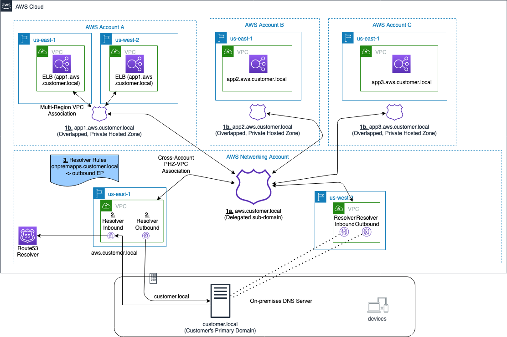

# 使用Route 53专用托管区域进行跨帐户多区域体系结构

由Anandprasanna Gaitonde和John Bickle撰写| 上 2021年1月20日| 在 [Amazon CloudWatch](https://aws.amazon.com/blogs/architecture/category/management-tools/amazon-cloudwatch/)，[Amazon Route 53](https://aws.amazon.com/blogs/architecture/category/networking-content-delivery/amazon-route-53/)，[Amazon VPC](https://aws.amazon.com/blogs/architecture/category/networking-content-delivery/amazon-vpc-networking-content-delivery/)，[架构](https://aws.amazon.com/blogs/architecture/category/architecture/)，[AWS Control Tower](https://aws.amazon.com/blogs/architecture/category/management-tools/aws-control-tower/)，[AWS Direct Connect](https://aws.amazon.com/blogs/architecture/category/networking-content-delivery/aws-direct-connect/)，[资源访问管理器（RAM）](https://aws.amazon.com/blogs/architecture/category/security-identity-compliance/resource-access-manager/)

*这篇文章是由AWS解决方案架构师Anandprasanna Gaitonde和AWS Enterprise Support高级技术客户经理John Bickle共同撰写的*

## 介绍

**许多AWS客户将内部业务应用程序分布在多个AWS帐户和本地上，以支持不同的业务部门**。在这样的环境中，您可能会发现有用的本地和不同AWS账户之间的DNS记录和域名的一致视图。AWS上的[Route 53专用托管区域](https://docs.aws.amazon.com/Route53/latest/DeveloperGuide/hosted-zones-private.html)（PHZ）和[解析器端点](https://docs.aws.amazon.com/Route53/latest/DeveloperGuide/resolver.html)为混合云环境中的集中式DNS创建了最佳架构构架。您的业务部门可以**使用灵活性和自治性来管理其应用程序的托管区域，并支持多区域应用程序环境以实现灾难恢复（DR）的目的**。

该博客介绍了一种架构，该架构提供了DNS的统一视图，同时允许不同的AWS账户管理子域。它利用具有重叠名称空间的PHZ和用于PHZ的跨帐户多区域VPC关联来为DNS创建高效，可扩展且高度可用的体系结构。

## 架构概述

您可以使用诸如[AWS Control Tower之类的](https://aws.amazon.com/controltower/)服务来设置**多账户环境，以在不同的AWS账户中托管来自不同业务部门的应用程序和工作负载**。但是，这些**应用程序必须符合基于组织策略和DNS层次结构更简单管理的命名方案**。最佳做法是，通过在共享网络帐户中配置[Amazon Route 53](https://aws.amazon.com/route53/)解析器终端节点来实现与本地DNS的集成。

以下是此体系结构的示例。

图1 –体系结构图

在此示例中，客户在customer.local域下具有本地应用程序。AWS托管的应用程序使用子域委托到aws.customer.local。此处的示例显示了**属于三个不同团队的三个应用程序，这些环境位于各自的AWS账户中，以实现自治和灵活性**。此架构模式遵循**“多帐户分散式”模型**的选项，如白皮书[针对Amazon VPC的混合云DNS选项中所述](https://d1.awsstatic.com/whitepapers/hybrid-cloud-dns-options-for-vpc.pdf)。

此体系结构包含三个关键组件：

**1. PHZ配置：** **在共享网络帐户中创建了子域aws.customer.local的PHZ**。这是为了支持团队不需要个人控制的辅助应用程序对PHZ的集中管理（图中的项目1a）。但是，对于关键业务应用程序，每个团队或业务部门都会创建自己的PHZ。例如，app1.aws.customer.local –帐户A中的Application1，app2.aws.customer.local –帐户B中的Application2，app3.aws.customer.local –帐户C中的Application3（图中的项目1b）。Application1是关键业务应用程序，并且具有严格的灾难恢复要求。该应用程序的DR环境也在us-west-2中创建。

为了在AWS账户与本地账户之间获得一致的DNS视图和有效的DNS查询路由，最佳实践是将所有PHZ与网络账户相关联。通过使用[专用托管区域与VPC的跨帐户关联，](https://docs.aws.amazon.com/Route53/latest/DeveloperGuide/hosted-zone-private-associate-vpcs-different-accounts.html)将在帐户A，B和C中创建的PHZ与网络帐户中的VPC[关联](https://docs.aws.amazon.com/Route53/latest/DeveloperGuide/hosted-zone-private-associate-vpcs-different-accounts.html)。这将从多个PHZ为网络帐户的VPC创建重叠的域。它也与网络帐户中的父子域PHZ（aws.customer.local）重叠。在这种情况下，如果两个或多个PHZ的命名空间重叠，则路由53解析器会根据[开发者指南中](https://docs.aws.amazon.com/Route53/latest/DeveloperGuide/hosted-zone-private-considerations.html#hosted-zone-private-considerations-private-overlapping)所述的最具体匹配来路由流量[。](https://docs.aws.amazon.com/Route53/latest/DeveloperGuide/hosted-zone-private-considerations.html#hosted-zone-private-considerations-private-overlapping)

**2.用于本地集成的Route 53解析器端点（图中的项目2）：** **网络帐户用于使用Route 53解析器端点设置与本地DNS的集成**，如[解析VPC与网络之间的DNS查询中](https://docs.aws.amazon.com/Route53/latest/DeveloperGuide/resolver.html)所示。**在us-east-1的VPC中创建了入站和出站Route 53解析程序端点，以充当本地DNS和AWS之间的集成**。本地到AWS之间的DNS通信需要[AWS Site2Site VPN连接](https://docs.aws.amazon.com/vpn/latest/s2svpn/VPC_VPN.html)或[AWS Direct Connect](https://aws.amazon.com/directconnect/)连接来承载DNS和应用程序通信。**对于每个解析器端点，可以指定两个或更多IP地址以映射到不同的可用区（AZ）。这有助于创建高度可用的体系结构**。

**3.路由53解析程序规则（图3中的项目）：**仅在网络帐户中创建转发规则，以将本地域（customer.local）的DNS查询路由到本地DNS服务器。如文档中[“与其他AWS账户共享转发规则并使用共享规则”](https://docs.aws.amazon.com/Route53/latest/DeveloperGuide/resolver-rules-managing.html#resolver-rules-managing-sharing)部分所述，[AWS Resource Access Manager](https://aws.amazon.com/ram/)（RAM）用于将规则共享给账户A，B和C。现在，帐户所有者可以像关联在自己的AWS账户中创建的规则一样，将这些共享规则与他们的VPC关联。如果您与另一个AWS账户共享该规则，那么您还将间接共享在规则中指定的出站终端节点，如“[创建入站和出站终端节点的注意事项](https://docs.aws.amazon.com/Route53/latest/DeveloperGuide/resolver.html#resolver-considerations-share-rules-share-outbound-endpoints)”部分中所述。文档中的“”。这意味着您使用一个区域中的一个出站终端节点将DNS查询从多个VPC转发到您的本地网络，即使VPC是在不同的AWS账户中创建的也是如此。解析程序开始将对规则中指定的域名的DNS查询转发到出站终结点，然后转发到本地DNS服务器。在此体系结构的两个区域中创建规则。

该体系结构具有以下优点：

1. 弹性和可扩展性
2. 使用VPC + 2端点，本地缓存和[可用区](https://aws.amazon.com/about-aws/global-infrastructure/regions_az/)（AZ）隔离
3. 最小转发跃点
4. 降低成本：最佳使用Resolver端点和转发规则

为了处理DR，以下是一些其他注意事项：

- 对于app1.aws.customer.local，相同的PHZ与us-west-2区域中的VPC关联。**虽然VPC是区域性的，但PHZ是全球性的，可以从不同区域的VPC访问相同的PHZ**。
- **在PHZ中设置了故障转移路由策略，并创建了故障转移记录**。但是，Route 53运行状况检查器（位于VPC外部）要求您的应用程序具有公共IP。由于这些业务应用程序在组织内部，因此可以配置[Amazon CloudWatch](https://aws.amazon.com/cloudwatch/)基于指标的运行状况检查，如[在私有托管区域](https://docs.aws.amazon.com/Route53/latest/DeveloperGuide/dns-failover-private-hosted-zones.html)中[配置故障转移中所述](https://docs.aws.amazon.com/Route53/latest/DeveloperGuide/dns-failover-private-hosted-zones.html)。
- 解析器端点是在VPC中网络帐户中另一个区域（us-west-2）中创建的。如果区域发生故障，这将允许本地服务器故障转移到这些辅助Resolver入站端点。
- 在网络帐户中创建了第二组转发规则，该规则使用us-west-2中的出站终结点。它们与帐户A共享，然后与us-west-2中的VPC关联。
- 此外，要使DR跨多个本地位置，本地服务器也应具有辅助备份DNS本地（未在图中显示）。
  这样可以确保用于DR设置的简单DNS体系结构，以及在区域出现故障时对应用程序进行无缝故障转移。

## 注意事项

- 如果应用程序1需要与应用程序2通信，则必须将帐户A的PHZ与帐户B共享。然后可以为不同帐户中的这些VPC有效地路由DNS查询。
- 在单个AZ /子网中为解析程序端点创建其他IP地址，以处理大量DNS流量。
- 在您的AWS环境中实施此类架构之前，[请](https://docs.aws.amazon.com/Route53/latest/DeveloperGuide/hosted-zone-private-considerations.html)查看[使用专用托管区域](https://docs.aws.amazon.com/Route53/latest/DeveloperGuide/hosted-zone-private-considerations.html)时的[注意事项](https://docs.aws.amazon.com/Route53/latest/DeveloperGuide/hosted-zone-private-considerations.html)。

## 概要

混合云环境可以利用Route 53专用托管区域的功能，例如重叠的名称空间以及执行跨帐户和多区域VPC关联的功能。这将为您的应用程序环境创建一个统一的DNS视图。该体系结构允许业务应用程序具有可伸缩性和高可用性。

标签： [体系结构](https://aws.amazon.com/blogs/architecture/tag/architecture/)，[灾难恢复](https://aws.amazon.com/blogs/architecture/tag/disaster-recovery/)，[DR](https://aws.amazon.com/blogs/architecture/tag/dr/)，[PHZ](https://aws.amazon.com/blogs/architecture/tag/phz/)，[专用托管区域](https://aws.amazon.com/blogs/architecture/tag/private-hosted-zones/)，[解析器端点](https://aws.amazon.com/blogs/architecture/tag/resolver-endpoints/)，[Route 53](https://aws.amazon.com/blogs/architecture/tag/route-53/)

原文：Using Route 53 Private Hosted Zones for Cross-account Multi-region Architectures

https://aws.amazon.com/cn/blogs/architecture/using-route-53-private-hosted-zones-for-cross-account-multi-region-architectures/