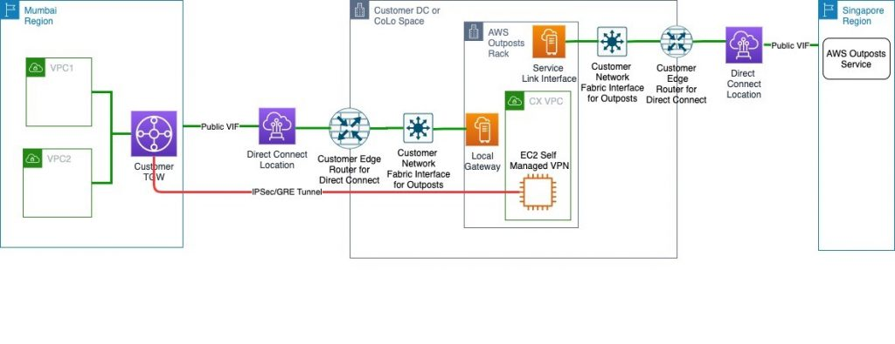

# 现场说明：使用AWS前哨基地在不同地震带中设置灾难恢复

由Vijay Menon | 上 2020年11月24日| 在 [建筑](https://aws.amazon.com/blogs/architecture/category/architecture/)，[AWS直接连接](https://aws.amazon.com/blogs/architecture/category/networking-content-delivery/aws-direct-connect/)，[AWS前哨](https://aws.amazon.com/blogs/architecture/category/compute/aws-outposts/)，[CloudEndure灾难恢复](https://aws.amazon.com/blogs/architecture/category/migration/cloudendure-disaster-recovery/)，[技术操作指南](https://aws.amazon.com/blogs/architecture/category/post-types/technical-how-to/)

**从中断中恢复关键任务工作负载，对于业务连续性以及为客户提供很少或没有中断的服务至关重要**。这就是为什么许多客户使用适合其需求的**灾难恢复（DR）策略**在多个位置复制其关键任务工作负载的原因。

使用AWS，客户可以通过**将应用程序的关键组件复制到另一个区域来部署多可用区高可用性设置或多区域设置**来实现这一目标。根据关键任务工作负载的RPO和RTO，[灾难恢复的要求](https://aws.amazon.com/blogs/publicsector/rapidly-recover-mission-critical-systems-in-a-disaster/)范围从简单的备份和还原到多站点，主动-主动，设置。在此博客文章中，我将说明如何将[AWS Outposts](https://aws.amazon.com/outposts/)用于AWS上的灾难恢复。

在许多地区，可以为在一个AWS区域中运行到同一国家/地区的另一个AWS区域中的工作负载（例如，在US-east-1和us-west-2之间的美国）设置灾难恢复。对于只有一个AWS区域的国家，可以在存在AWS区域的另一个国家中设置灾难恢复。该方法可以设计用于在商定的级别上连续，恢复和恢复关键业务流程，并限制对人员，流程和基础架构（包括IT）的影响。其他原因包括**尽量减少此类事件引起的运营，财务，法律，声誉和其他重大后果**。

但是，对于处理关键用户数据（PII，PHI或财务数据）的关键任务工作负载，印度和加拿大等国家/地区已制定法规，要求**在同一国家/地区内**以“安全距离”设置灾难恢复设置。这样可以**确保符合监管机构规定的任何数据主权或数据本地化要求**。**“安全距离”是指灾难恢复站点与主站点之间的距离，使得企业可以在发生任何自然灾害或影响主站点的工业事件时继续经营**。根据地理位置，此**安全距离可能为50KM或更大**。这些法规限制了客户必须使用另一个国家/地区的另一个AWS区域作为其在AWS上运行的主要工作负载的灾难恢复站点的选项。

在此博客文章中，我描述了使用**AWS Outposts的架构，该架构可帮助在同一国家/地区内的AWS上建立能够满足监管机构要求的距离的灾难恢复**。这种体系结构还可以帮助客户遵守给定国家/地区中各种数据主权法规。这种架构的另一个优点是主站点和灾难恢复站点的同质性。您现有的IT团队可以在同类环境中使用熟悉的AWS工具和技术来设置和操作灾难恢复站点。

## 先决条件

本博客文章的读者应熟悉WAN连接，BGP和以下AWS服务等基本网络概念：

- [亚马逊EC2](https://aws.amazon.com/ec2/?ec2-whats-new.sort-by=item.additionalFields.postDateTime&ec2-whats-new.sort-order=desc)
- [亚马逊VPC](https://aws.amazon.com/vpc/)
- [AWS前哨站](https://docs.aws.amazon.com/outposts/latest/userguide/what-is-outposts.html)
- [AWS Transit网关](https://docs.aws.amazon.com/vpc/latest/tgw/what-is-transit-gateway.html)
- [AWS托管VPN](https://aws.amazon.com/vpn/)
- [AWS直接连接](https://aws.amazon.com/directconnect/)
- 适用于网络基础架构的[AWS Marketplace Amazon机器映像（AMI）](https://aws.amazon.com/marketplace/b/2649366011)

## 架构概述

我将使用印度的一个示例客户场景来说明该架构，在该客户中，客户将AWS Mumbai Region用于其关键任务工作负载。此工作负载需要进行灾难恢复设置以符合当地法规，并且灾难恢复设置必须位于与孟买不同的地震带中。同样，由于**受监管业务的性质，用户/敏感数据需要存储在印度内部**。

以下是显示逻辑设置的体系结构图。

此解决方案类似于典型的[AWS Outposts用例](https://d1.awsstatic.com/re19/IDC-Whitepaper-outposts-new.pdf)，在该[案例中](https://d1.awsstatic.com/re19/IDC-Whitepaper-outposts-new.pdf)，客户订购Outposts安装在自己的数据中心（DC）或CoLocation站点（Colo）中。它将遵循[AWS Outposts文档中](https://docs.aws.amazon.com/outposts/latest/userguide/outposts.pdf)描述的分担责任模型。

唯一的区别是，AWS Outpost父区域将是除孟买以外的最接近的区域，在本例中为新加坡。然后，客户将在本地配置AWS Direct Connect公共VIF，以提供到新加坡地区的服务链接。这样可确保即使AWS Mumbai Region发生断电影响控制平面可用性，控制平面仍可通过AWS新加坡地区保持可用。然后，您可以在AWS Outposts机架中启动和管理AWS Outposts支持的资源。

对于不应出国的数据平面流量，可以使用以下选项：

- 在AWS Outposts子网中的运行路由器AMI的EC2实例与主要区域中的AWS Transit网关（TGW）之间，配置一个自我管理的虚拟专用网络（VPN）。
- 在AWS Outposts子网中的运行路由器AMI的EC2实例与主要区域中的虚拟专用网关（VGW）之间，配置一个自我管理的虚拟专用网络（VPN）。

**注意：**本示例中的主要区域是AWS孟买区域。该**VPN将通过本地网关和DX公共VIF进行设置。这样可确保数据平面流量不会穿越任何国家/地区的网络（印度）以符合监管机构要求的数据本地化**。

## 架构演练

1. 确保您的数据中心（DC）或搭配设施的选择（Colo）符合[AWS Outposts](https://docs.aws.amazon.com/outposts/latest/userguide/outposts-requirements.html)的[要求](https://docs.aws.amazon.com/outposts/latest/userguide/outposts-requirements.html)。

2. 按照[文档中](https://docs.aws.amazon.com/outposts/latest/userguide/order-outpost-capacity.html)所述创建前哨并订购前哨容量。确保登录到AWS Singapore Region的AWS Outposts控制台时执行此步骤。

3. 如AWS Outpost[文档中](https://docs.aws.amazon.com/outposts/latest/userguide/local-network-connectivity.html)所述，在AWS Outposts和您的DC / Colo网络之间设置连接。这包括[为服务链接和本地网关（LGW）](https://docs.aws.amazon.com/outposts/latest/userguide/local-network-connectivity.html#network-layer-connectivity)设置[VLAN](https://docs.aws.amazon.com/outposts/latest/userguide/local-network-connectivity.html#network-layer-connectivity)。

4. 提供的AWS直连连接和公共VIF通过最接近你的DC /科罗拉多州和主要地区之间AWS直接连接的位置。

   - 对于DC / Colo和AWS Direct Connect位置之间的WAN连接，您可以选择任何一家电信提供商，也可以与[AWS Direct Connect合作伙伴](https://aws.amazon.com/directconnect/partners/)之一[合作](https://aws.amazon.com/directconnect/partners/)。
- 此公共VIF将用于通过AWS Outposts服务链接将AWS Outposts附加到其在新加坡的父区域。它还将用于在AWS Outposts子网和TGW或VGW之间建立IPsec GRE隧道，以进行数据平面流量（在后续步骤中进行说明）。
   - 另外，您可以为服务链接和数据平面流量提供单独的直接连接连接和公共VIF，以更好地将两者隔离。您将必须在Direct Connect连接上为服务链接流量以及数据平面流量（例如主区域和AWS哨站之间的数据复制）配置足够的带宽。
- 为了获得最佳体验和弹性，AWS建议您使用与AWS区域的双1Gbps连接。也可以通过Internet传输来实现这种连接；但是，我建议使用AWS Direct Connect，因为它提供了AWS与DC / Colo环境之间的专用连接，在许多情况下，与基于Internet的连接相比，它可以降低网络成本，增加带宽吞吐量并提供更一致的网络体验。
   
5. 

   在AWS Outposts中[创建一个子网](https://docs.aws.amazon.com/outposts/latest/userguide/launch-instance.html)，并从该子网中的AWS Marketplace启动运行您选择的路由器AMI的EC2实例。此EC2实例用于在主区域中建立到TGW或VGW的IPsec GRE隧道。

   - 选择一个可以根据AMI提供程序满足您的带宽要求的EC2实例，并[禁用](https://docs.aws.amazon.com/vpc/latest/userguide/VPC_NAT_Instance.html#EIP_Disable_SrcDestCheck)此EC2实例的[源/目标检查](https://docs.aws.amazon.com/vpc/latest/userguide/VPC_NAT_Instance.html#EIP_Disable_SrcDestCheck)。
- 从为您的AWS Outposts设置的客户拥有的池中为此EC2实例[分配一个弹性IP地址](https://docs.aws.amazon.com/outposts/latest/userguide/launch-instance.html#allocate-coip)。
   
6. 在这些EC2实例的安全组中添加规则，以允许来自VGW或TGW终结点公共IP地址的ISAKMP（UDP 500），NAT穿越（UDP 4500）和ESP（IP协议50）。

7. NAT（网络地址转换）在第5步中分配给连接到AWS Direct Connect或Internet传输的边缘路由器上的公共IP地址的EIP。此公共IP将用作建立到主要区域的IPsec GRE隧道的客户网关。

8. 使用用于对EC2实例进行NAT转换的公共IP地址[创建客户网关](https://docs.aws.amazon.com/vpn/latest/s2svpn/SetUpVPNConnections.html#vpn-create-cgw)。请按照[创建客户网关](https://docs.aws.amazon.com/vpn/latest/s2svpn/SetUpVPNConnections.html#vpn-create-cgw)中类似的过程中的步骤进行操作。

9. 使用在步骤8中创建的客户网关为传输网关创建VPN附件。此VPN必须是基于动态路由的VPN。有关步骤，请参阅[Transit Gateway VPN附件](https://docs.aws.amazon.com/vpc/latest/tgw/tgw-vpn-attachments.html)。如果您要使用主要区域中的VGW将客户网关连接到VPC，请按照[如何在办公室网络和Amazon Virtual Private Cloud之间创建安全连接](https://aws.amazon.com/premiumsupport/knowledge-center/create-connection-vpc/)的步骤进行[操作。](https://aws.amazon.com/premiumsupport/knowledge-center/create-connection-vpc/)。

10. 配置客户网关（在AWS Outposts子网中运行路由器AMI的EC2实例）端进行VPN连接。您可以在步骤9的VPN创建过程中根据AWS建议的配置进行基础配置。如本[文档](https://docs.aws.amazon.com/vpn/latest/s2svpn/SetUpVPNConnections.html#vpn-download-config)所述，可以在VPN设置后从AWS控制台下载建议的示例配置。

11. 修改AWS Outpost子网的路由表，使其指向在第5步中启动的EC2实例，并将其作为主要区域（在本示例中为AWS Mumbai）中VPC中任何目的地的目标。

此时，您将在主要区域中的VPC与AWS Outposts中的资源之间建立端到端连接。现在，此连接可用于将数据从主站点复制到AWS Outposts以进行灾难恢复。这样可使设置符合任何内部或外部数据本地化要求。

## 结论

在此博客文章中，我描述了在没有第二个AWS区域的国家中使用AWS Outposts for AWS进行灾难恢复的架构。要设置灾难恢复，您现有的IT团队可以在统一的环境中使用熟悉的AWS工具和技术来设置和操作灾难恢复站点。要了解有关AWS Outposts的更多信息，请参阅[文档](https://docs.aws.amazon.com/outposts/latest/userguide/what-is-outposts.html)和[FAQ](https://aws.amazon.com/outposts/faqs/)。

##### Field Notes根据他们在解决客户实际业务问题方面的经验，提供了AWS解决方案架构师，顾问和技术客户经理的动手技术指导。

TAGS： [AWS前哨](https://aws.amazon.com/blogs/architecture/tag/aws-outposts/)[基地](https://aws.amazon.com/blogs/architecture/tag/field-notes/)，[现场记录](https://aws.amazon.com/blogs/architecture/tag/field-notes/)

原文：Field Notes: Setting Up Disaster Recovery in a Different Seismic Zone Using AWS Outposts

https://aws.amazon.com/cn/blogs/architecture/field-notes-setting-up-disaster-recovery-in-a-different-seismic-zone-using-aws-outposts/